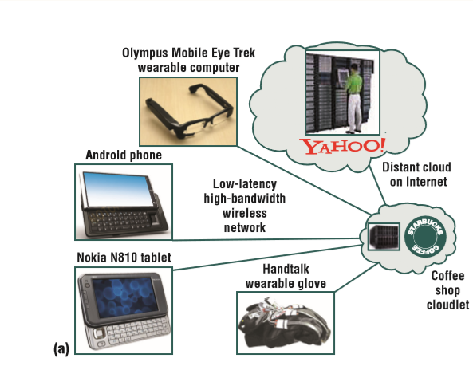
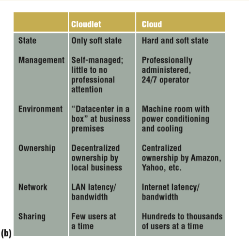

# 论文题目：The Case for VM-Based Cloudlets in Mobile Computing

## 技术问题
移动设备由于硬件的限制，计算、存储能力等等都不能满足大多数用户的需求，因此需要用别的方式来满足用户的需求。
## 研究背景
cloudlet是一种可信的、资源丰富的计算机或计算机集群，这些计算机与网络连接良好，可以被附近的移动设备使用。当移动设备随用户在物理世界中移动时，我们利用临时定制的近端基础设施的策略称为基于cloudlet、资源丰富的移动计算。由于cloudlet物理上的接近性和单跳网络延迟，在这个架构中很容易实现清晰的交互响应，这对于无缝地增强人类的认知至关重要。使用cloudlet还简化了满足多个用户交互生成和接收媒体(如高清视频和高分辨率图像)的峰值带宽需求的挑战。为各种应用程序快速定制基础设施是一项关键需求，从概念验证原型得到的结果表明，VM技术确实可以帮助满足这一需求。

## 正文
该文论述了在移动计算中以虚拟云服务器为基础的云计算。

#### 一般的云计算的局限性：
较高的网络延迟是一个最基本的障碍。用户交互关键路径上的广域网延时会降低系统响应的简洁性，从而损害可用性。即使是微不足道的用户应用程序交互也会导致云计算中的延迟。

#### cloudlet设想
与其依赖遥远的云服务器，我们能够利用附近资源丰富的cloudlet解决移动设备的资源匮乏问题。通过这种方式，我们可以通过对cloudlet的低延迟、单跳、高带宽无线访问来满足实时交互响应的需求。移动设备充当瘦客户机，所有重要的计算都在附近的cloudlet中进行。cloudlet物理上的接近性是必不可少的:在cloudlet内执行的应用程序的端到端响应时间必须是快速的(几毫秒)和可预测的。如果附近没有可用的cloudlet，移动设备可以优雅地降级到涉及远程云的回退模式，或者在最坏的情况下，仅使用它自己的资源。稍后，当设备发现附近的cloudlet时，可以返回完整的功能和性能。

#### cloudlet风险评估
从本质上讲，cloudlet类似于“盒子里的数据中心”:它是自我管理的，只需要电源、Internet连接和访问控制就可以设置。这种简单的管理对应于计算资源的设备模型，因此在诸如咖啡店或医生办公室之类的业务场所进行部署非常简单。在内部，cloudlet类似于多核计算机集群，具有千兆的内部连接和高带宽无线局域网。为了在不受监控的地区安全部署，cloudlet可以包含一个防篡改或防篡改的附件，其中包含第三方远程监视硬件完整性的功能。最重要的是，cloudlet只包含软状态，比如缓存其他地方可用的数据或代码副本。因此，cloudlet的损失或破坏并不是灾难性的。

#### 基于VM技术的cloudlet
除非对该基础设施的软件管理已经达到理想情况，cloudlet基础设施的广泛部署都不会发生。一个理想的cloudlet应该支持尽可能广泛的移动用户，对他们的软件限制最小。文中的解决方案是使用硬件VM技术对cloudlet基础设施进行临时定制。强调“瞬态”非常重要:使用前的定制和使用后的清理确保cloudlet基础设施在每次使用之后都恢复到原始软件状态，而不需要手动干预。VM干净地封装并将临时客户软件环境与cloudlet基础设施的永久主机软件环境分离。主机和客户环境之间的接口有狭窄的、稳定、广泛的特点，确保了cloudlet投资的持久性，并使移动用户在世界任何地方找到兼容cloudlet。因此，与流程迁移或软件虚拟化等替代方法相比，基于vm的方法更加稳固。与基于语言的虚拟化方法相比，它的限制更少，也更通用。

## 总结与评价
该文描述了基于vm的一种新型的云计算手段，利用广泛分布的计算机群以达到减少网络延迟等问题。再利用vm使这些cloudlet设备能够更加的稳定，保证了计算的准确度和速度，增加了泛用性。但是如何令设备广泛推广是这类新型产品的首要考虑。成本是否过高，安装是否过于麻烦，这些都是生产商和研究者应该考虑的问题。解决这个问题的一种方法是建立信任，其中用户执行一些预使用操作来检查cloudlet的主机软件。另一种方法是基于声誉的信任，在这种方法中，用户验证cloudlet服务提供者的身份，然后依靠法律、业务或其他外部因素来推断信任。第一个方法更具有防御性和健壮性，但也更麻烦，而第二种方法更脆弱，但也更有用，因为它速度快，侵入性最小。如何让设备就像wifi一样让大众接受，这是研究者的一个重要课题。