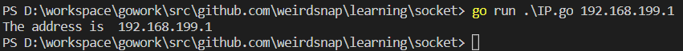

# 学习周报

## 本周计划

- 初步了解socket编程
- 搭建服务器原型

## 本周工作

- 学习TCP/IP协议族
- 了解socket编程
- 搭建基础服务器

## 整体规划

- 第一周 socket基础学习，原型开发

- 第二周 服务器部署测试

- 第三周 服务器并发测试于优化

## 遇到的问题

---

## 周报：golang socket编程学习

## socket编程

在网络中确定一个进程首先要确定主机(使用ip地址)，然后是协议，最后是端口。
有了ip，协议，端口这三个东西，我们就可以在网络中确定一个进程。

### net包

我们主要使用golang中的net包来实现。其实我们已经用过net/http包，其实他里面吗也是使用socket等底层来实现的。
`type IP []byte` 这是net包中定义的IP类型

```lang=go
package main
import (
    "net"
    "os"
    "fmt"
)
func main() {
    if len(os.Args) != 2 {
        fmt.Fprintf(os.Stderr, "Usage: %s ip-addr\n", os.Args[0])
        os.Exit(1)
    }
    name := os.Args[1]
    addr := net.ParseIP(name)
    if addr == nil {
        fmt.Println("Invalid address")
    } else {
        fmt.Println("The address is ", addr.String())
    }
    os.Exit(0)
}

```


也就是获取一个字符串，使用net的ParseIP方法转化成ip类型。

### TCP Socket

当我们知道如何通过网络端口访问一个服务时，那么我们能够做什么呢？作为客户端来说，我们可以通过向远端某台机器的的某个网络端口发送一个请求，然后得到在机器的此端口上监听的服务反馈的信息。作为服务端，我们需要把服务绑定到某个指定端口，并且在此端口上监听，当有客户端来访问时能够读取信息并且写入反馈信息。

而类型`TCPConn`就是用来作为客户端和服务端j交互的通道，他有两个主要的函数。

```
func (c *TCPConn) Write(b []byte) (int, error)
func (c *TCPConn) Read(b []byte) (int, error)
```
写和读取，这两个函数接受byte数组返回int和error类型。这个类型可以用在客户端和服务端来进行数据的读写。

还有类型`TCPAddr`
```lang=go
type TCPAddr struct {
    IP IP
    Port int
    Zone string // IPv6 scoped addressing zone
}
```
可以通过`ResolveTCPAddr`获取一个`TCPAddr`

这个函数是这样定义的

`func ResolveTCPAddr(net, addr string) (*TCPAddr, os.Error)`

- net参数是"tcp4"、"tcp6"、"tcp"中的任意一个，分别表示TCP(IPv4-only), TCP(IPv6-only)或者TCP(IPv4, IPv6的任意一个)。
- addr表示域名或者IP地址，例如"www.google.com:80" 或者"127.0.0.1:22"。

### TCP client

建立客户端，通过`net`包中的`DialTCP`函数来建立一个TCP连接，并返回一个`TCPConn`类型的对象，同时当连接建立时服务器端也创建一个同类型的对象，此时客户端和服务器段通过各自拥有的`TCPConn`对象来进行数据交换。

此函数定义为`func DialTCP(network string, laddr, raddr *TCPAddr) (*TCPConn, error)`


```lang=go
package main

import (
	"fmt"
	"io/ioutil"
	"net"
	"os"
)

func main() {

	if len(os.Args) != 2 {
		fmt.Fprintf(os.Stderr, "Usage: %s host:port ", os.Args[0])
		os.Exit(1)
	}
	service := os.Args[1] // 通过命令行参数获取的服务器存储在这里

	tcpAddr, err := net.ResolveTCPAddr("tcp4", service) //通过此函数获得一个tcpaddr类型

	checkError(err)

	conn, err := net.DialTCP("tcp", nil, tcpAddr) // 创建链接

	checkError(err)

	_, err = conn.Write([]byte("HEAD / HTTP/1.0\r\n\r\n")) // 写请求头

	checkError(err)

	result, err := ioutil.ReadAll(conn) // 读取相应

	checkError(err)

	fmt.Println(string(result)) // 打印响应

	os.Exit(0)
}
func checkError(err error) {
	if err != nil {
		fmt.Fprintf(os.Stderr, "Fatal error: %s", err.Error())
		os.Exit(1)
	}
}

```

首先程序将用户的输入作为参数service传入net.ResolveTCPAddr获取一个tcpAddr,然后把tcpAddr传入DialTCP后创建了一个TCP连接conn，通过conn来发送请求信息，最后通过ioutil.ReadAll从conn中读取全部的文本，也就是服务端响应反馈的信息。


### TCP server

```lang=go
package main

import (
	"fmt"
	"net"
	"os"
	"time"
)

func main() {
	service := ":1200"
	tcpAddr, err := net.ResolveTCPAddr("tcp4", service)
	checkError(err)
	listener, err := net.ListenTCP("tcp", tcpAddr)
	checkError(err)
	for {
		conn, err := listener.Accept()
		if err != nil {
			continue
		}
		go handleClient(conn)
	}
}

func handleClient(conn net.Conn) {
	defer conn.Close()
	daytime := time.Now().String()
	conn.Write([]byte(daytime)) // don't care about return value
	// we're finished with this client
}
func checkError(err error) {
	if err != nil {
		fmt.Fprintf(os.Stderr, "Fatal error: %s", err.Error())
		os.Exit(1)
	}
}

```