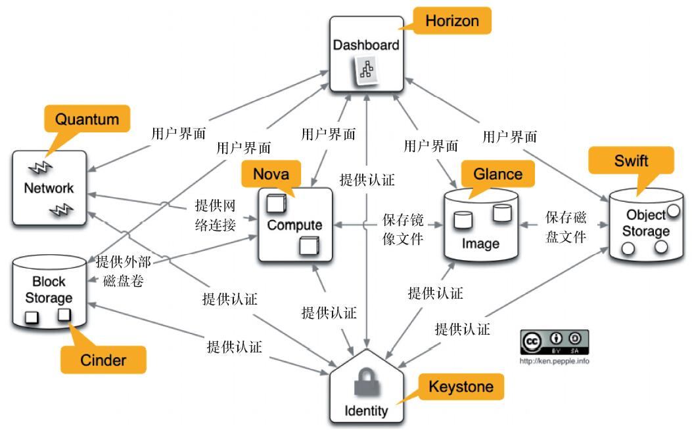

# 第四周学习周报

## 本周具体工作计划

（1）了解`OpenStack`的基本组件，架构

## 本周已完成的内容

### 已完成的工作

计划（1）

### 未完成的工作

无

### 问题与困难

见建议与意见

## 下周工作计划

（1）部署OpenStack

## 建议与意见

OpenStack体系大而复杂，且网上中文OpenStack的材料不多，希望TA能多提供一些适合初学者的OpenStack学习资源。

----

# OpenStack学习报告

## OpenStack的组件

1. Compute（Nova）

Compute的项目代号是Nova，它根据需求提供虚拟机服务，创建虚拟机或对虚拟机做热点迁移等，实现了对AWS的EC2 API兼容。

2. Object Storage（Swift）

Object Storage的项目代号是Swift，它允许存储或检索文件，能以低成本的方式通过RESTful API管理大量无结构的数据。许多的公司内部使用Swift来存储数据。

3. Identity （Keystone）

Identity的项目代号是Keystone，为所有OpenStack服务提供身份验证和授权，跟踪用户以及他们的权限，提供一个可用服务以及API的列表。

4. Dashboard（Horizon）

Dashboard的代号是Horizon，它为所有OpenStack的服务提供一个模块化的基于Django的界面，通过这个界面，无论是最终的用户还是运维人员都可以完成大多数的操作，比如启动虚拟机、分配IP地址、动态迁移等。

5. Block Storage（Cinder）

Block Storage的项目代号是Cinder，提供块存储服务。因为Nova项目的庞大，volume服务的需求进一步会增加nova-volume的复杂度，同时考虑到nova-volume跟其他OpenStack项目的交互，所以OpenStack成立Cinder来扩展nova-volume的功能。

6. Network （Neutron）

Network的项目代号是Neutron，用于提供网络连接服务，允许用户创建自己的虚拟网络并连接各种网络设备接口。Neutron也来自于Nova的一个服务——nova-network。

7. Image Service （Glance）

Image Server的项目代号是（Glance），它是OpenStack的镜像服务组件，主要提供一个虚拟机镜像的存储、查询和检索服务，通过提供一个虚拟磁盘映像的目录和存储库，为Nova的虚拟机提供镜像服务。

8. Telemetry （Ceilometer）

Telemetry的项目代号是Ceilometer，它为OpenStack云的计费、基准、扩展性以及统计等目的提供检测和计量。

9. Orchestration （Heat）

Orchestration的项目代号是Heat，它的服务支持多样化的综合云应用。

## OpenStack的架构

OpenStack由上面9个具有*RESTful API*的WEB服务所实现，是一系列组件服务的集合。每个组件实现自己的功能，再通过消息队列和数据库来相互调用，互相通信。这样的设计模式**解耦合**了组件，项目之间的依赖关系，能灵活地满足我们实际环境的需要，组合出适合的架构。OpenStack是**分布式系统**，不仅各个组件可以分布式地部署，组件中的服务也可以分布式的部署。分布式的特性让OpenStack具有极大的灵活性，伸缩性和高可用性。 

OpenStack的概念架构

实际中，我们可以选择自己需要的组件，搭建适合的云计算平台。 

