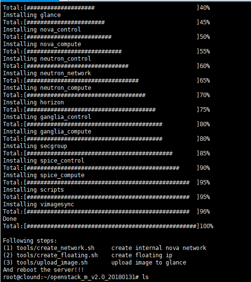
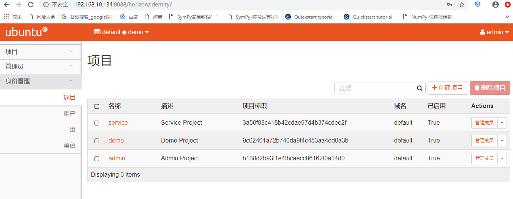

# 部署单节点Vinzor-openstack
## 1.创建Ubuntu虚拟机
根据“ **Ubuntu安装手册-桌面版和服务器版.pdf** ”创建Ubuntu虚拟机。
## 2.将openstack安装文件放入到虚拟机之中
1. 将XShell与linux虚拟机进行连接（[参考链接](https://jingyan.baidu.com/article/cbf0e5004dba022eaa289308.html))，要注意的是linux需要先安装openssh-server，其可通过命令`apt-get install openssh-server`进行安装。
2. 在XShell窗口中运行命令`apt-get install lrzsz`,安装完成后即可通过`rz`命令将文件从windows中传入虚拟机中，`sz`命令从虚拟机中下载文件到windows。
3. 将openstack安装文件复制到/root目录，并且解压。

## 3.运行安装脚本
1. 进入openstack安装文件夹通过命令`./run.sh`运行安装脚本，依据 “ **Vinzor-openstack安装手册Neutron模式.doc** ” 进行安装。  
安装脚本运行结果：  

2. 重启虚拟机之后，在浏览器中访问网页 <NAT 网卡ip>:8088/horizon，
结果：  

3. 登陆后的结果：

