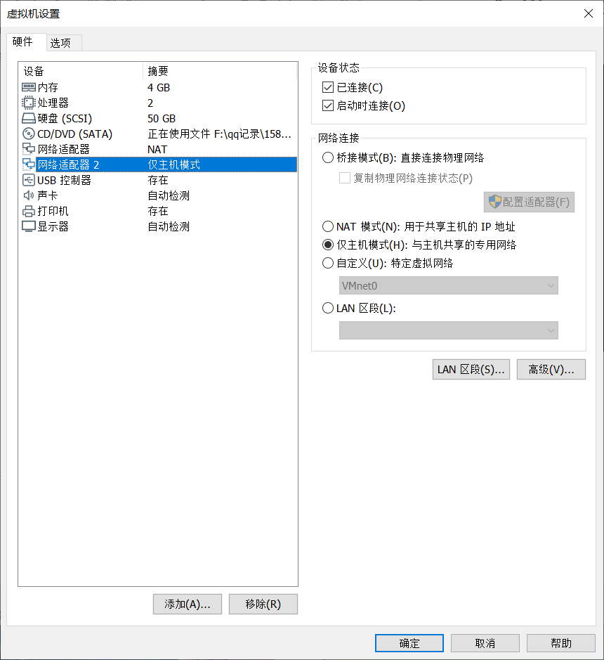
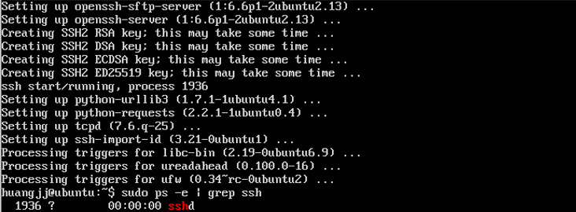
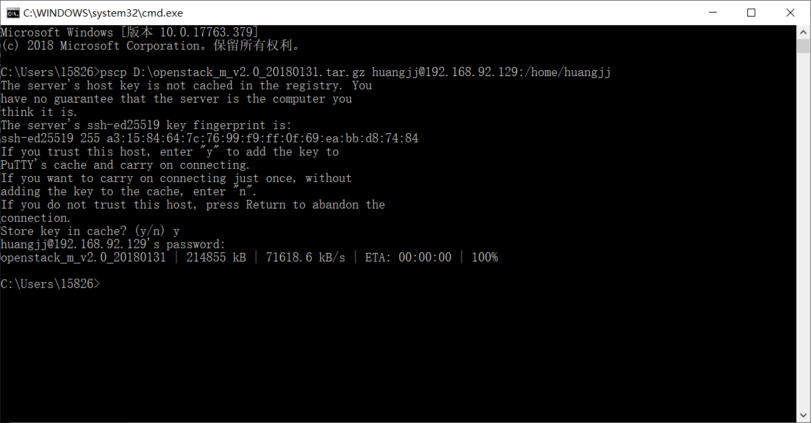
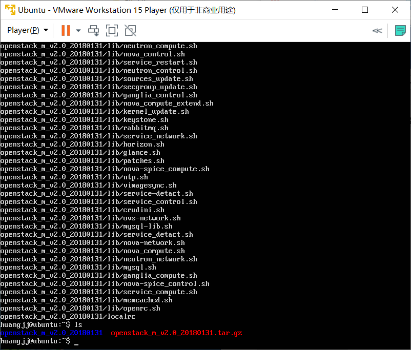
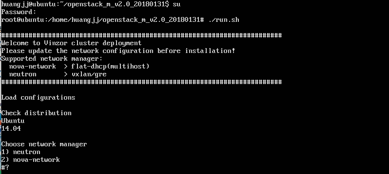
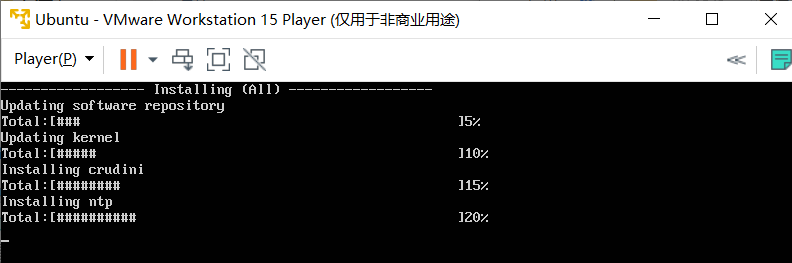
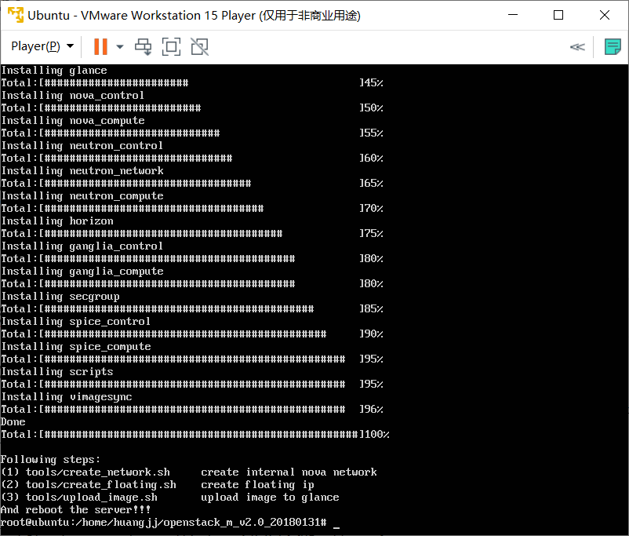
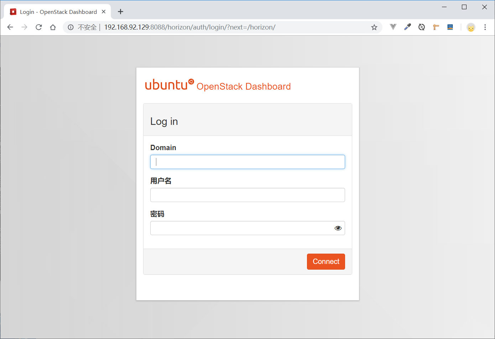

1. 创建虚拟机，虚拟机配置如下：

2. 挂载ubuntu server 14.04.5镜像，参照《ubuntu安装手册》进行安装；

3. 安装mysql-server和keepalived：

   使用sudo apt-get update，sudo apt-get install mysql-server ，sudo apt-get install keepalived命令进行安装，在安装mysql-server时把root的密码设成admin12；

4. 安装openssh-server，使用PSCP工具将OpenStack安装包上传到虚拟机中并解压：

   （1）使用sudo apt-get install openssh-server命令安装openssh-server，使用sudo service ssh

   start启动ssh服务，sudo ps -e | grep ssh命令查看是否启动成功：

   （2）使用pscp工具上传OpenStack安装包：

   

   （3）使用tar -xzvf  file.tar.gz命令进行解压：

   

5. 使用su命令进入root模式，执行run.sh脚本（注意安装过程将以NAT模式设置的网卡（如eth0）设置为内网及控制节点的网络，而以仅限主机模式设置的网卡（如eth1）设置为外部网络）：

   

6. 安装完成后，脚本提示重启：

   

   

7. 重启虚拟机，宿主机访问<NAT网卡的ip>:8088/horizon，出现以下界面，部署成功：

   

   

