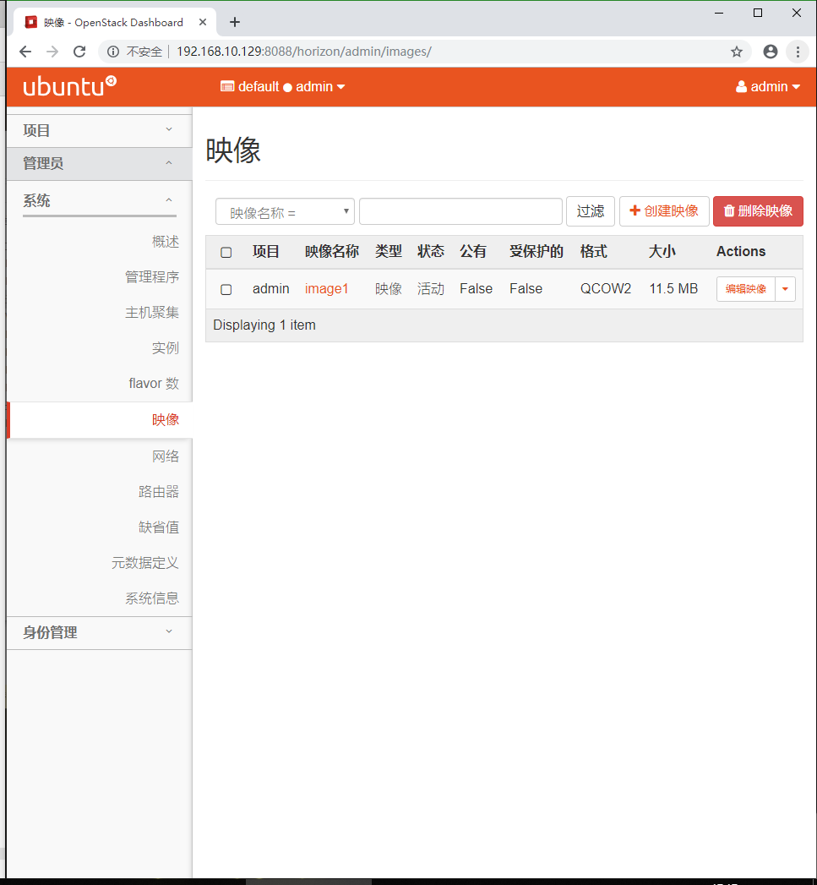
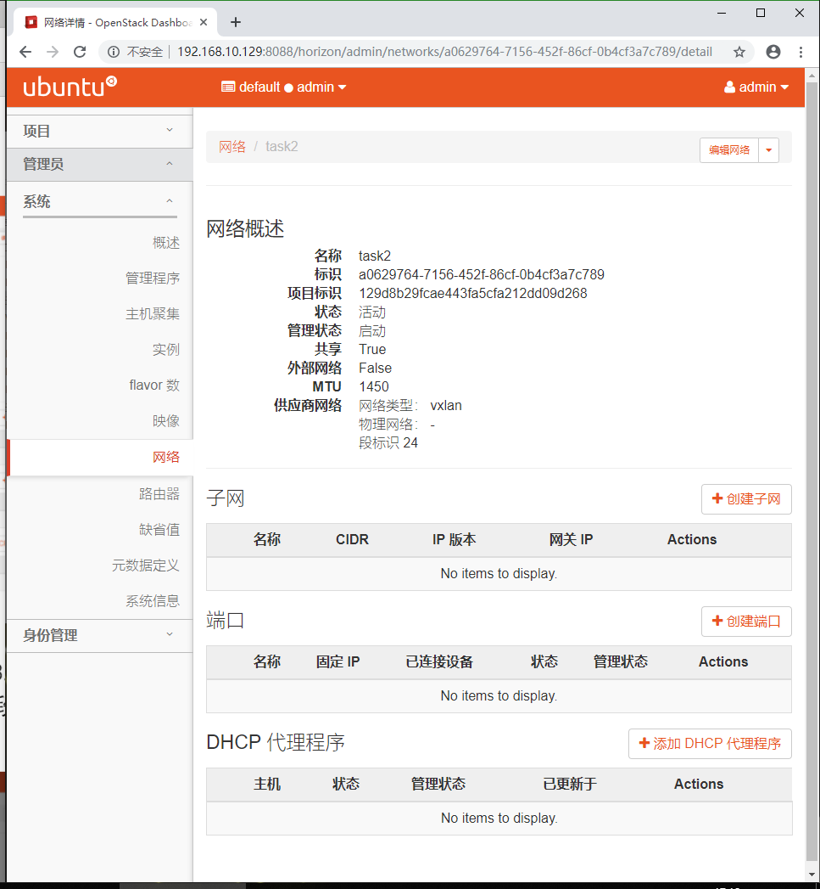
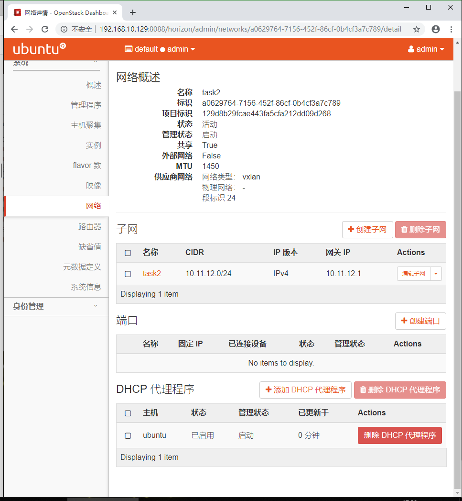
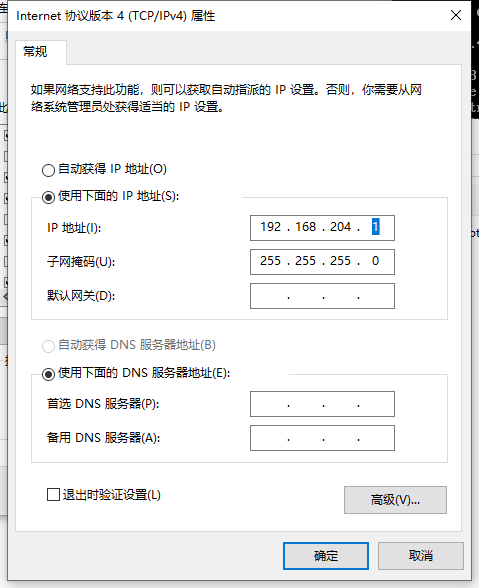
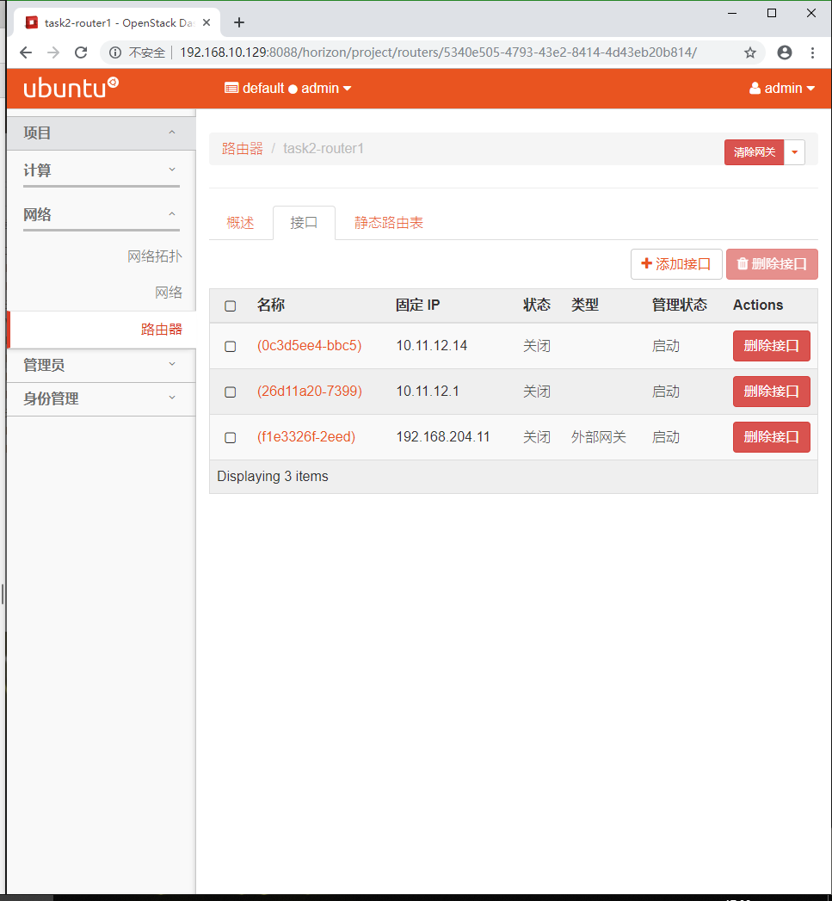
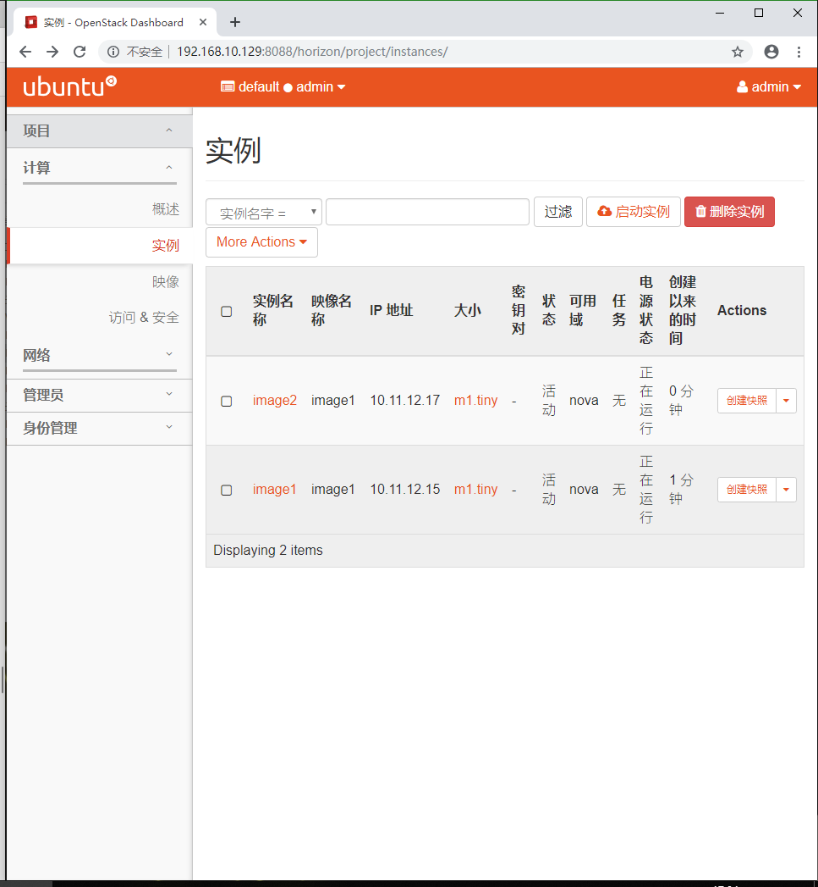
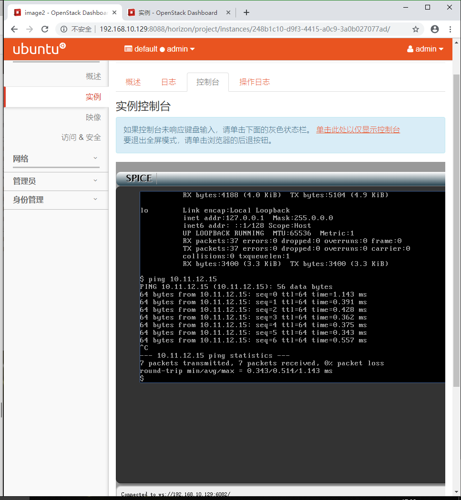
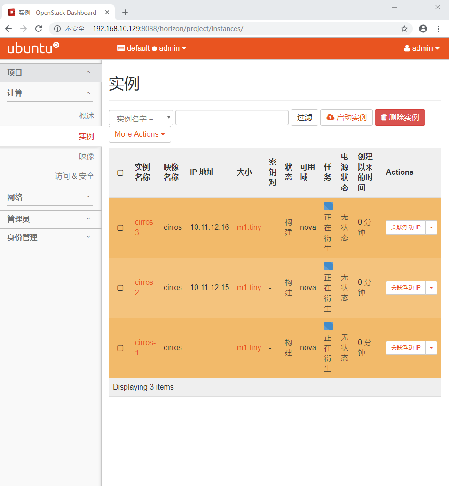
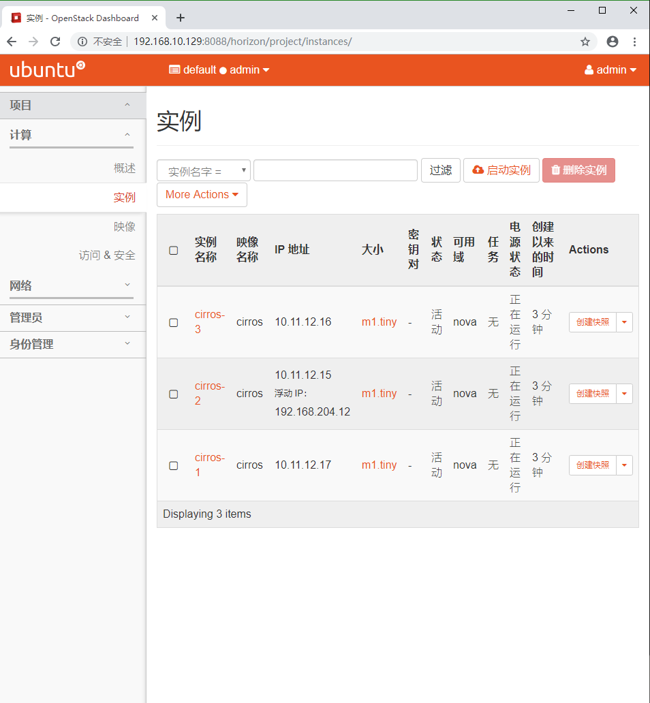
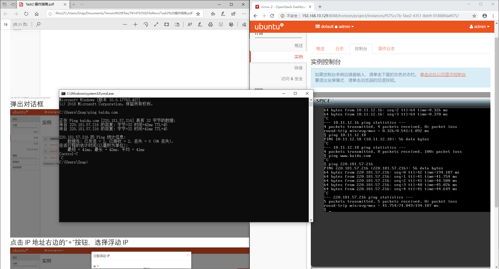

# 学习周报 （2019上半学期第6周）

## 本周具体工作计划

- 用集成脚本一气呵成安装openstack，能够成功打开dashboard
- 虚拟网络设置
- 开启实例

## 本周主要工作内容

1. 成功搭建openstack环境后，通过dashboard登录。

2. 登陆后查看系统信息（看启动了什么服务）

3. 测试网络配置是否正确

   - 上传cirros镜像、创建flavor、创建vxlan网络、ext_net网络、路由

   - 创建实例

   - 添加安全组规则（ssh、icmp）

   - 尝试从不同实例之间互相ping，看是否成功。以及实例能否ping通外网。

## 已经完成工作

1. 成功搭建openstack环境后，通过dashboard登录。

2. 登陆后查看系统信息（看启动了什么服务）

3. 测试网络配置是否正确

   - 上传cirros镜像、创建flavor、创建vxlan网络、ext_net网络、路由

   - 创建实例

   - 尝试从不同实例之间互相ping，看是否成功。以及实例能否ping通外网。

## 未完成工作

3. 测试网络配置是否正确

   - 添加安全组规则（ssh、icmp）

## 问题与困难

最开始不知道是否由于之前的部署有问题，导致在最后一步绑定浮动ip的时候，总是绑定失败，返回一个无法找到客户端的错误，也去百度了错误信息尝试了一些修改但是一直解决不了。最后决定重头开始来一次，于是重创建虚拟机一直到部署又来了一遍，这一次就很顺利直接绑定成功了浮动ip（但是不知道为什么这次vmtool一直装不上去= =就用winscp传文件了）。

## 下周工作计划

3. 测试网络配置是否正确

   - 添加安全组规则（ssh、icmp）

---

## 实验过程

首先登录，然后检查启用的系统信息，之后上传一个镜像，上传后得到：

然后添加网络，内部网络：

再为之添加子网：

添加外部网络差不多，这里就没截图。

我这里是用主机模式了，所以我们去看看这个网卡的配置，然后把本地的共享给他并且修改地址和虚拟机网络设置里面的一致：

添加路由器：

新建实例：

实例之间ping：

之后这一次就卡住了，绑定浮动ip就是不行。

然后一切重来之后：
还是到创建三个实例：

这次居然可以绑定上去了。

然后赶紧试一试ping百度：

成功了。开心。