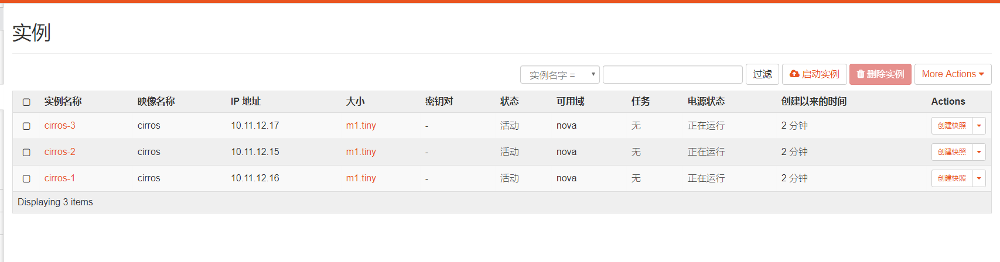

### 1. 前情概要  
在Task1中使用监本部署了Opensatck在虚拟机上，其中虚拟机有两块网卡，一块为 **“NAT模式”**，另一块为 **“仅主机模式”**。在安装中设定**控制节点以及内部网络**为 **“NAT模式”** 的网卡，而 **“仅主机模式”** 的网卡设为 **外部网络** 的接口。  

### 2. 登陆 Dashboard
根据部署在Openstack时设置的控制节点的IP地址 **192.168.10.135**，在浏览器中输入 dashboard的访问网址， **192.168.10.135：8080/horizon**。出现如下网站：  
  
其中domain为default，用户名为 admin，密码为安装时自己设定的，输入完成后点击connect，登陆。出现如下页面：  

### 3. 查看系统信息
查看系统信息结果图如下：

从图中可以看到总共开启了四个服务，分别是 **keystone、neutron、glance和nova**。

### 4. 上传镜像
操作步骤与**“Task2 操作指南.pdf”**中所展示的一致。创建结果图如下：  

### 5. 创建一个内部网络
操作步骤与**“Task2 操作指南.pdf”**中所展示的一致。  
创建了一条 int 网络的记录结果如下图：  

点击 int 记录中的网络名称“int”，进入网络的设置页面如下:  

创建子网结果如下：

### 6. 创建一个外部网络
1. 将宿主机的网络共享给Vmware的虚拟网卡VMnet1
	
其中以太网3就是Vmware的虚拟网卡VMnet1。点击确定。  
通过 Vmware workstation 的虚拟网络编辑器，找到原来设置
的仅主机网络的网段  
  
可以看到仅主机模式的子网地址是**192.168.43.0**，所以将VMnat1的网卡的ip地址改为 **192.168.43.1**.
 
另外，我们还需要在 Vmware workstation 的虚拟网络编辑器中，将仅主机网络的 **dhcp 服务**关闭。

2. 创建外部网络
操作步骤与**“Task2 操作指南.pdf”**中所展示的一致,除了网段改为**192.168.43.0/24**。 
创建外部网络结果如下：  

点击 ext 外部网络这个记录的网络名称“ext”，进入网络的管理界面并创建外部子网结果如下：  

### 7. 创建一个路由器
操作步骤与**“Task2 操作指南.pdf”**中所展示的一致。
最终结果如下：

### 8. 创建实例
操作步骤与**“Task2 操作指南.pdf”**中所展示的一致。
最终结果如下：  

### 9. 测试实例在内部网络中是否能互相ping通
点击实例名称**“cirros-1”**，进入实例管理界面，进入控制台选卡，结果如下：

根据提示，用户为 cirros，密码为 gocubsgo，登入 cirros 操作系统

查看网卡情况：

可以看到跟前面创建实例时自动分配的 IP 是一致的，这时候我们尝试 ping 一下 cirros-2和 cirros-3，它们对应的 ip 地址分别为**10.11.12.16** 和 **10.11.12.17**。结果如下：
  
可以看到成功ping通。

### 10. 给 cirros-1 绑定浮动 IP，查看是否能访问外网
关联浮动ip操作步骤与**“Task2 操作指南.pdf”**中所展示的一致。结果如下：  

ping 网关 **192.168.43.1**结果如下：

ping 百度(**220.181.57.216**)结果如下：

一开始ping不通百度是因为接的是wifi，而与虚拟机共享的网卡没有连网，重新联网后成功ping通百度。