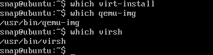
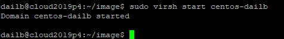

# 学习周报 （2019上半学期第8周）

## 本周具体工作计划

- 制作windows7或者centos7或者ubuntu的镜像，格式为qcow2
- 利用openstack上传镜像
- 能够成功创建、开启实例

## 本周主要工作内容

- 制作镜像：先下载要制作镜像的iso文件，启动系统

- 在镜像中添加一个文件，文件内容写入branch名称，保存

- 用命令行或dashboard创建镜像

- 查看镜像的信息、服务

- 创建该镜像的实例

- 实例能够ping通外网

- 尝试用xshell或者桌面远程连接实例（安全组）

- 开启实例后能够打开之前创建的文件

## 已经完成工作

- 制作镜像：先下载要制作镜像的iso文件，启动系统

- 在镜像中添加一个文件，文件内容写入branch名称，保存

- 用命令行或dashboard创建镜像

- 查看镜像的信息、服务

- 创建该镜像的实例

- 实例能够ping通外网

- 开启实例后能够打开之前创建的文件

## 未完成工作

## 问题与困难

## 下周工作计划

---

## task3

### 尝试本地虚拟机

- 首先检查是否有如下命令 

发现virt-install不存在，进行安装

安装失败，百度一些`has no installation candidate`相关问题，发现涉及apt-get update 和 upgrade，但是好像记得ta说不要upgrade，遂放弃使用自己的虚拟机

### 使用服务器

添加用户先略过不谈，添加好只后切换到新用户

- 首先检查是否有如下命令 

- 接着检查 virt 是否有 default 网络 

- 可见已经有配置，我们查看下配置文件

- 在目录下创建image文件夹并上传centos7文件

- 创建 qcow2 文件 

- 创建 vm，安装 centos7 

选择了5920端口，于同学的5919区别

可以看到运行

- 使用 vnc-viewer 连接 vm，进行系统安装 

进行系统安装，等待完成

安装完成，进行重启

重新使用vnc-viewer 连接 vm，创建学号姓名命名的文件

- 创建，并登录 Openstack 查看镜像 

- 创建实例

- ping 外网

- 配置安全组并用远程ssh

查了一些自己本机的公网ip，emmm写个应该说是很随便的ssh远程ip限制

ssh链接成功

- 打开之前创建的文件

