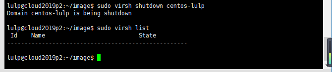
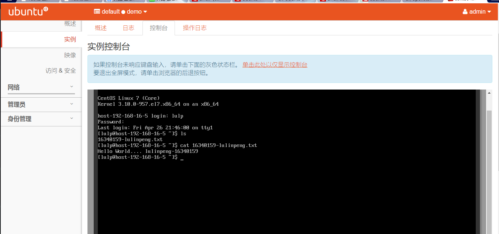

## 一. 制作镜像前准备（在本地尝试制作后）
1. 用XShell远程连接服务器   
开启一个新的会话并且设置主机地址为服务器IP地址：  

设置账户和密码，点击连接即可：  

2. 根据 **Task3制作镜像.pdf** 中所述创建自己的账户
创建用户：  
  
把用户添加到sudo用户组：  

3. 检查是否拥有 `qemu-img` , `virsh` , `virt-install` 这三个命令  
  
发现需要安装`virt-install` 这个命令,用 `sudo apt-get install virtinst` 进行安装

4. 根据 **Task3制作镜像.pdf** 中所述检查default网络发现没有，并且创建。  
  

## 二. 制作 centos 镜像
以下操作均根据 **Task3制作镜像.pdf** 中所属进行操作。

1. 创建 qcow2文件  
  
2. 创建虚拟机，安装 centos7  
  

远程连接创建的centos7，并且创建文件：  

在服务器端关闭虚拟机：  

3. 将 qcow2 文件上传到 openstack  

## 三. 在openstack中创建实例
1. 映像结果  

其中 **centos7-x86_64_lulp** 就是制作的镜像  
2. 创建实例结果   
实例：  
  
在控制台中打开自己创建的文件: 
  
关联浮动IP后，在控制台中ping百度结果:

