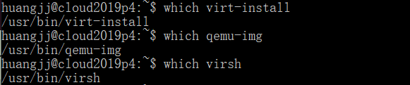
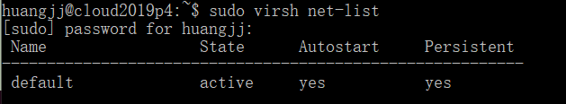
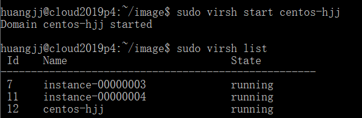
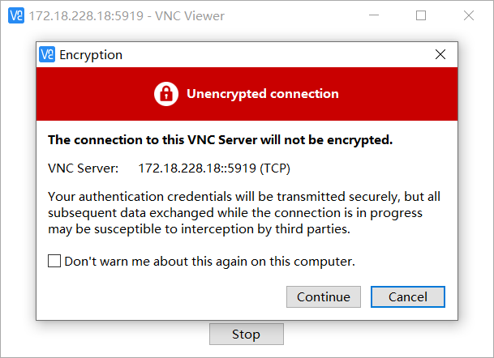
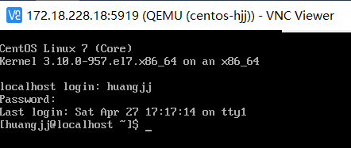
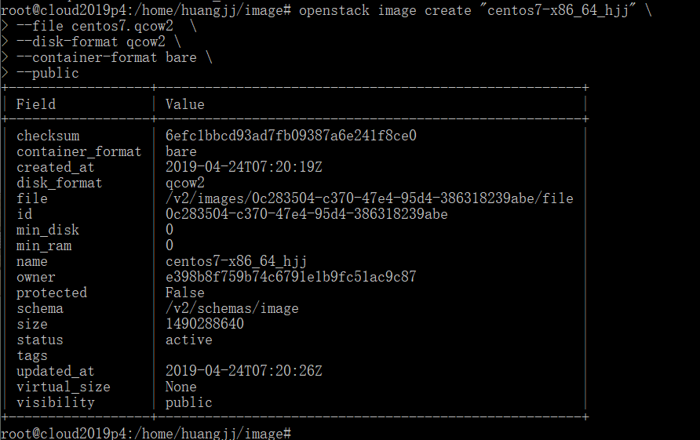
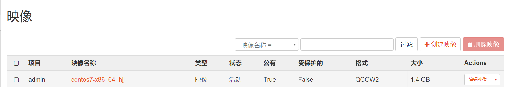
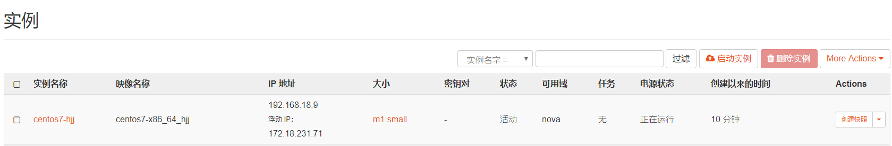
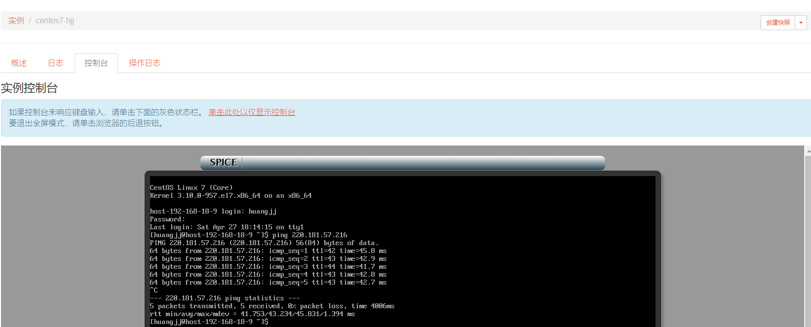

# 操作文档

1. ssh登录服务器，创建用户并加入sudo用户组。

2. 检查是否有qemu-img, virsh, virt-install命令：

   

3. 添加 default 网络:

   

4. 上传centos安装文件，创建qcow2文件:

   

5. 创建 vm，安装 centos7:

   

6. 使用 vnc-viewer 连接 vm，进行系统安装:

   

7. 再使用 vnc-viewer 连接，登录自己创建的用户，创建一个文件:

   

   

8. 将 qcow2 文件上传到 openstack:

   

   

9. 创建实例:

   

10. Ping 通外网:

    