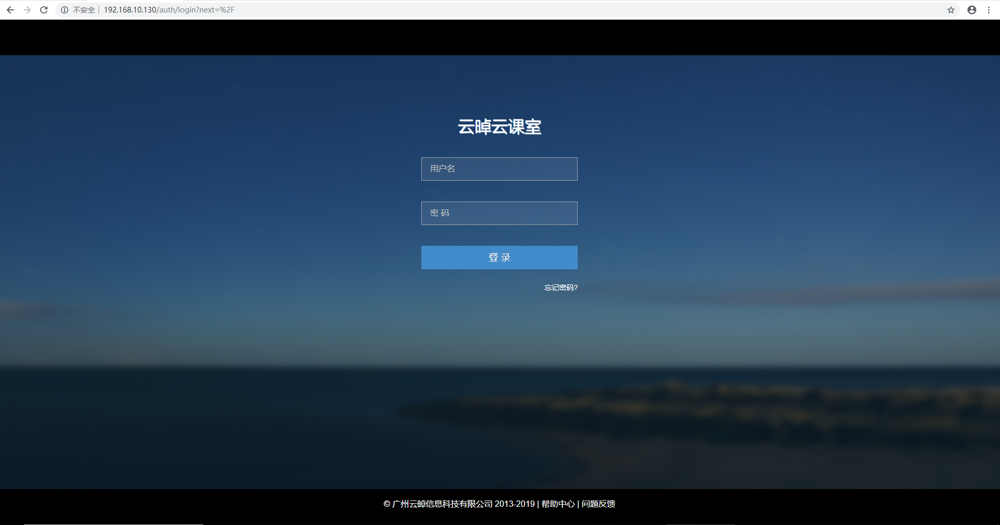

# 学习周报 （2019上半学期第10周）

## 本周具体工作计划

安装云桌面
云桌面系统功能体验
了解云桌面相关背景知识

## 本周主要工作内容

- 提供vindesk部署安装包，根据安装文档来安装(忽略激活管理系统部分)，注意配置localrc的时候，按服务器小组分配情况配置openstack的ip地址和密码。
- 安装完成无报错，并且能够打开系统并截图即为任务成功
- 可以自行探索下相关的功能
- 创建固定桌面
- 创建一个课程，并创建一个对应的课程桌面，课程名称请命名为自己的分支

## 已经完成工作

## 未完成工作

## 问题与困难

## 下周工作计划

## 周报

### VDI概念解释以及实现原理
（个人理解总结、工作流程，如果通过画图来体现，最好自己画图）

全称Virtual Desktop Infrastructure，即虚拟桌面基础架构

他用系统镜像制作大量虚拟机桌面，然后通过网络传输使得客户机可以在任何地方的终端机上面进行访问。

VDI让大规模的虚拟桌面得以高度集中化的管理，让每个人的电脑运行在自己看不到的地方，由于理念比较新，方案一提出得到了市场的广泛传播，但是由于该构架要求所有桌面虚拟机集中在服务端运行，受到硬件工艺和网络传输的限制，造成性能、成本、兼容性等诸多问题。

### 实现的协议介绍
（spice、vnc、rdp），进行对比

spice是由Qumranet开发的开源网络协议，2008年红帽收购了Qumranet获得了这个协议。SPICE是红帽在虚拟化领域除了KVM的又一“新兴技术”，它提供与虚拟桌面设备的远程交互实现,主要应用在桌面虚拟化,支持图像,2D传输,720P视频播放,目前,spice主要目标是为qemu虚拟机提供高质量的远程桌面访问,它致力于克服传统虚拟桌面的一些弊端,并且强调用户体验。但是呢相对而言spice目前不支持虚拟机中的3D效果,对于windows7系统虚拟机,其aero桌面特效也无法启用,因为spice使用远程连接,所以其高度依赖网络,如果网络环境不好,使用起来将会是一间很痛苦的事情

VNC(Virtual Network Computing)是基于RFB（Remote Frame Buffer）协议进行通信的，是一个基于平台无关的简单显示协议的超级瘦客户系统。vnc的缺省端口是main:5900（C/S）和http:5800（B/S）端口。RFB (远程帧缓存) 是一个远程图形用户的简单协议，因为它工作在帧缓存级别上，所以它可以应用于所有的窗口系统，例如：X11,Windows和Mac系统。远程终端用户使用机器（比如显示器、键盘、鼠标）的叫做RFB客户端，提供帧缓存变化的被称为RFB服务器。RFB是基于tcp的一个应用层协议。

RDP, Remote Desktop Protocol，远程桌面协议，是一个多通道（multi-channel）的协议，让用户（客户端或称“本地电脑”）连上提供微软终端机服务的电脑（服务器端或称“远程电脑”）。大部分的Windows、Linux、FreeBSD、Mac OS X都有相应的客户端。服务端听取送到 TCP 3389 端口的数据。该协议是对国际电信联盟发布的一个国际标准的多通道会议协议T.120 的一个扩展。

||spic|vnc|rdp|
|:-:|:-:|:-:|:-:|
|系统支持|linux|linux&windows|linux&windows|
|对带宽需求|较小|较大|较大|

## task4操作文档

### 安装云桌面

-  准备安装脚本

上传到/root

- 解压安装脚本 

tar解压，得到build文件夹

- 进入解压后的文件夹下的build文件夹，编辑localrc参数文件 

修改为控制节点ip，关闭桌面网关

-  运行脚本 

运行./run.sh进行安装

安装成功！

### 安装后工作

- 检查管理系统服务状态 

- 修改系统配置文件 

- 打开云桌面

登录。进入主页

- 制作镜像试试

添加学生老师用户并创建课程，我添加了以dlb为后缀的学生和老师账户

- 创建固定桌面

用云桌面客户端试一下

额，centos打不开桌面是为什么，试了用网页是可以打开的

感觉共享文件夹也挺有意思，试一下。咦需要先创建一个服务器。
