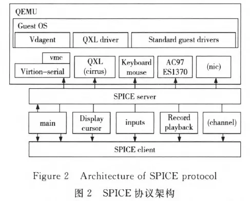
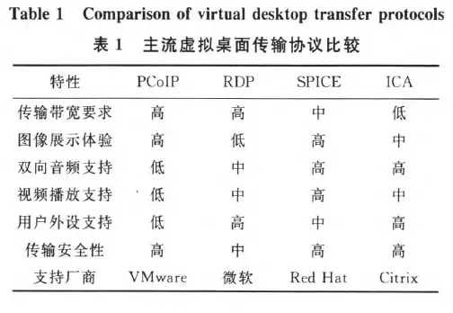
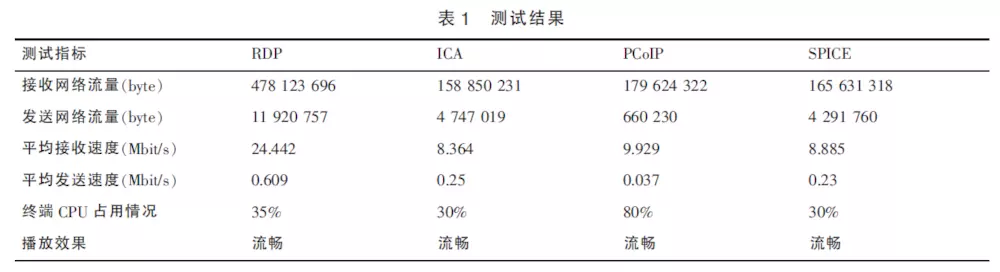

# 第十、十一周学习周报

## 本周主要工作内容

### 已完成的工作

- 根据安装文档来安装云桌vindesk
- 创建课程及课程对应桌面

### 未完成的工作

无

### 问题与困难

对云桌面和OpenStack的工作交互方式还是比较模糊

## 下周工作计划

无

---

# 学习报告

## VDI概念解释

### 个人理解

VDI是云桌面的一种实现架构。

### 工作流程

VDI实现在client/server的架构中。服务端将镜像复制多次，运行多个虚拟机并使用远程显示协议通过网络与本地客户端设备通信，用户通过该远程显示协议与应用程序交互。所有使用的应用程序和数据都保留在远程系统上，所以对服务端的硬件和网络带宽的要求较高。只有显示器，键盘和鼠标信息与本地客户端设备通信，本地客户端设备可以是传统的PC /笔记本电脑，平板电脑，甚至是智能手机。

## SPICE、VNC、RDP协议介绍对比

VNC、SPICE、RDP都是远程桌面协议。

### VNC

VNC使用远程帧缓冲协议（RFB）来远程控制另一台计算机。它将键盘和鼠标事件从一台计算机传输到另一台计算机，通过网络将图形屏幕更新转发回另一个方向。

### SPICE

SPICE是redhat开发的开源的专门的桌面虚拟化数据传输协议。SPICE架构包括客户端、SPICE服务端和相应的QXL设备、QXL驱动等。客户端运行在用户终端设备上，为用户提供桌面环境。SPICE服务端以动态连接库的形式与KVM虚拟 机整合，通过SPICE协议与客户端进行通信。 

 

### RDP

RDP是Microsoft开发的**专有**协议，它为用户提供通过网络连接连接到另一台计算机的图形界面。

支持：

- 32位颜色支持。还支持8,15,16和24位颜色。
- 使用[RC4](https://en.wikipedia.org/wiki/RC4)加密算法的128位加密，自版本6开始。
- 音频重定向允许用户处理远程桌面上的音频，并将声音重定向到本地计算机。
- 文件系统重定向允许用户在终端会话中使用远程桌面上的本地文件。
- 打印机重定向允许用户在终端会话中使用本地打印机，就像使用本地或网络共享打印机一样。
- 端口重定向允许在终端会话中运行的应用程序直接访问本地串行和并行端口。
- 远程计算机和本地计算机可以共享剪贴板。

### 对比

 

 

## 参考

1. [VDI、IDV、RDV三种云桌面的区别](http://www.richtech.cn/show/114.html)
2. [SPICE协议的理解](https://www.jianshu.com/p/8bfc1bc2fa9f)
3. [Desktop virtualization](https://en.wikipedia.org/wiki/Desktop_virtualization#Virtual_desktop_infrastructure)
4. [远程桌面协议](https://en.wikipedia.org/wiki/Remote_Desktop_Protocol)

