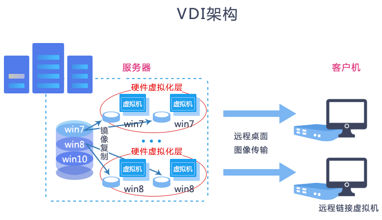

# 第十、十一周学习周报

## 本周具体工作计划

- 安装云桌面
    - 提供vindesk部署安装包，根据安装文档来安装(忽略激活管理系统部分)，注意配置localrc的时候，按服务器小组分配情况配置openstack的ip地址和密码。
    - 安装完成无报错，并且能够打开系统并截图即为任务成功
    - 可以自行探索下相关的功能
- 云桌面系统功能体验
    - 创建固定桌面
    - 创建一个课程，并创建一个对应的课程桌面，课程名称请命名为自己的分支
- 了解云桌面相关背景知识
    - VDI概念解释以及实现原理（个人理解总结、工作流程，如果通过画图来体现，最好自己画图）
    - 实现的协议介绍（spice、vnc、rdp），进行对比
## 本周主要工作内容

### 已经完成工作

- 安装云桌面
- 云桌面系统功能体验
- 了解云桌面相关背景知识

## 未完成工作

无

## 问题与困难

无

## 下周工作计划

---

## 第十、十一周学习周报

### VDI概念解释以及实现原理

VDI，英文全称Virtual Desktop Infrastructure，即虚拟桌面基础架构，属于云桌面技术之一。    
VDI的概念很简单。它不是给每个用户都配置一台运行Windows XP 或Vista（后文统称为Windows XP）的桌面PC，而是通过在数据中心的服务器运行Windows XP，将你的桌面进行虚拟化。用户通过来自客户端设备（客户机或是家用PC）的客户计算协议与虚拟桌面进行连接，用户访问他们的桌面就像是访问传统的本地安装桌面一样。   
工作流程如下图：服务端使用镜像制作大量虚拟机，客户机通过网络远程连接虚拟机，与虚拟机进行交互。

### 实现的协议介绍（spice、vnc、rdp），进行对比

Spice虚拟桌面传输协议，最初是由Qumranet开发，后来被RedHat收购并开源。经过几年的社区开发，Spice协议已经能在实际应用中一展拳脚，和商业协议ICA 、PCoIP等相抗衡，与上述商业化的远程桌面协议相比，Spice协议具有如下优点：（1）开源：易于扩展和功能定制；（2）跨平台：Windows/Linux/Mac OS平台全兼容；（3）支持外接设备：除常用USB设备外，打印机和扫描仪等设备也能在远程使用；（4）丰富的媒体支持：包括视频、音频、图像；（5）更小的带宽占用：Spice里内置图像压缩算法，有效减少数据传输时的带宽占用；（6）更安全的数据传输：Spice可以使用OpenSSL加密传输数据。

VNC（Virtual Network Computing），为一种使用RFB协议的屏幕画面分享及远程操作软件。此软件借由网络，可发送键盘与鼠标的动作及即时的屏幕画面。VNC与操作系统无关，因此可跨平台使用，例如可用Windows连线到某Linux的计算机，反之亦同。甚至在没有安装客户端程序的计算机中，只要有支持JAVA的浏览器，也可使用。
VNC系统由客户端，服务端和一个协议组成。VNC的服务端目的是分享其所运行机器的屏幕，服务端被动的允许客户端控制它。VNC客户端（或Viewer）观察控制服务端，与服务端交互。VNC协议Protocol（RFB）是一个简单的协议，传送服务端的原始图像到客户端（一个X,Y位置上的正方形的点阵数据），客户端传送事件消息到服务端。

RDP（Remote Desktop Protocol）是一个多通道（multi-channel）的协议，让用户（客户端或称“本地计算机”）连上提供微软终端机服务的计算机（服务端或称“远程计算机”）。大部分的Windows都有客户端所需软件。其他操作系统也有这些客户端软件，例如Linux、FreeBSD、Mac OS X。伺服端计算机方面，则监听送到TCP 3389端口的数据。

对比：    

|              | SPICE                     | VNC            | RDP                 |
| ------------ | ------------------------- | -------------- | ------------------- |
| BIOS屏幕显示 | 能                        | 能             | 不能                |
| 全彩支持     | 能                        | 能             | 能                  |
| 更改分辨率   | 能                        | 能             | 能                  |
| 多显示器     | 多显示器支持（高达4画面） | 只有一个屏幕   | 多显示器支持        |
| 图像传输     | 图像和图形传输            | 图像传输       | 图像和图形传输      |
| 视频播放支持 | GPU加速支持               | 不能           | GPU加速支持         |
| 音频传输     | 双向语音可以控制          | 不能           | 双向语音可以控制    |
| 鼠标控制     | 客户端服务器都可以控制    | 服务器端控制   | 服务器端控制        |
| USB传输      | USB可以通过网络传输       | 不能           | USB可以通过网络传输 |
| 适用系统     | linux                     | windows、linux | windows、linux      |

