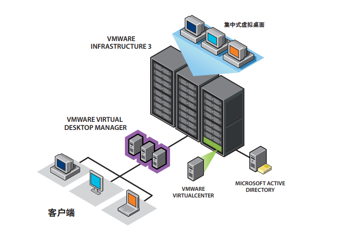
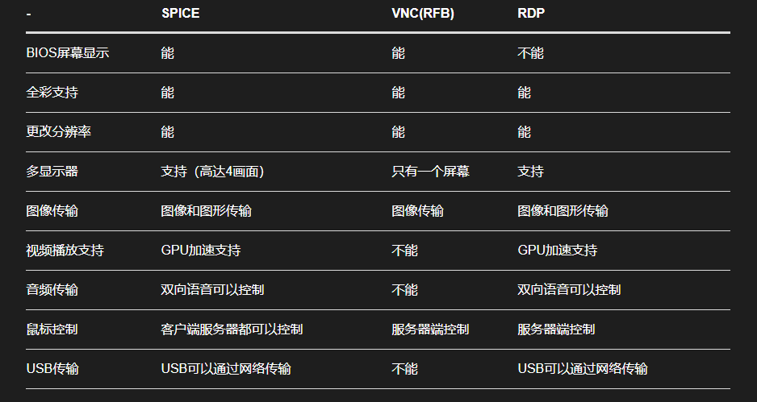

# 本周具体工作计划
1. 了解VDI概念解释以及实现原理  
2. 了解实现的协议（spice、vnc、rdp），并进行对比  
## 本周工作主要内容  
1. 了解VDI概念解释以及实现原理  
2. 了解实现的协议（spice、vnc、rdp），并进行对比  
### i.已完成工作  
#### VDI  
- VDI全称为 **Virtual Desktop Infrastructure**，即虚拟桌面基础架构。它是一种 **虚拟化技术** 。这种技术可以将桌面操作系统托管到数据中心的服务器上，是基于服务计算的。VDI有两种主要方法： **持久性和非持久性** 。 **持久性VDI** 为每个用户提供他或她自己的桌面映像，可以自定义和保存以供将来使用，就像传统的物理桌面一样。 **非持久性VDI** 提供了一个统一的桌面池，用户可以在需要时访问这些桌面。 每次用户注销时，非持久桌面都会恢复为原始状态。简单来说 **VDI** 就是将桌面操作系统部署再数据中心中，而用户能够通过网络对自己再数据中心的操作系统进行访问与控制。  

- **VDI** 工作流程  
大概架构图如下：  
  
用户通使用终端（PC或者瘦客户机）通过网络对VDI服务的提供商请求一个桌面，提供商的 **虚拟桌面管理器（Virtual Desktop Manage）** 通过查询当前 **活动的虚拟机目录** 分配一个虚拟桌面操作系统给用户进行操作。

---

#### spice、vnc、rdp协议的介绍，对比
1. **SPICE，即Simple Protocol for Independent Computing Environment（独立计算环境简单协议）** 是红帽企业虚拟化桌面版的主要技术组件之一，具有自适应能力的远程提交协议，能够提供与物理桌面完全相同的最终用户体验。用户能够通过网络来远程访问自己的桌面。  

2. **VNC ，即Virtual Network Console（虚拟网络控制台）** 是一款优秀的远程控制工具软件，由著名的 ** AT&T 的欧洲研究实验室** 开发的。VNC 是在基于 UNIX 和 Linux 操作系统的免费的开源软件，远程控制能力强大，高效实用。其由两部分组成：一部分是客户端的应用程序(vncviewer)；另外一部分是服务器端的应用程序(vncserver)。  

3. **RDP, 即Remote Desktop Protocol（远程桌面协议）** 是一个多通道（multi-channel）的协议，让用户能够使用本地的电脑来连接控制远端的电脑。

4. 三个协议之间的比较

### ii. 未完成工作 
无

### iii. 问题与困难
无

## 下周工作计划
暂无