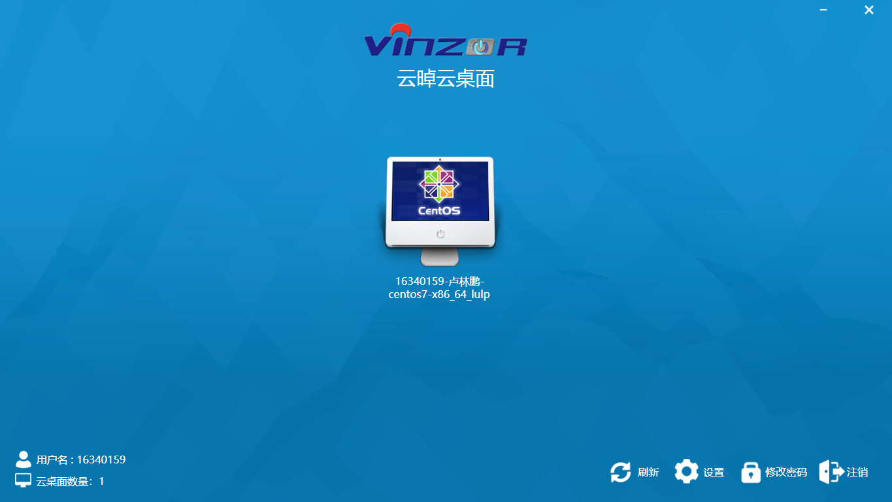

## 一、安装云桌面
1. 利用Xshell连接本地的虚拟机，然后通过 `rz` 命令将安装包传输到虚拟机的root目录中。  
2. 根据安装文档进行云桌面的安装。  
3. 检查管理系统服务状态结果如下：  
  
4. 云桌面系统截图  
  

## 二、云桌面功能体验
### 创建固定桌面
1. 创建的桌面信息如下：  
  
2. 打开固定桌面结果如下：  

### 创建课程
1. 添加一个学生：    
    
2. 创建课程：      
  
3. 课程信息:    
  
4. 课程参与学生:     
    
5. 课程桌面：  
  
6. 打开客户端，登陆账号：  
  
7. 登陆结果：  
  
8. 课程桌面显示结果：  

