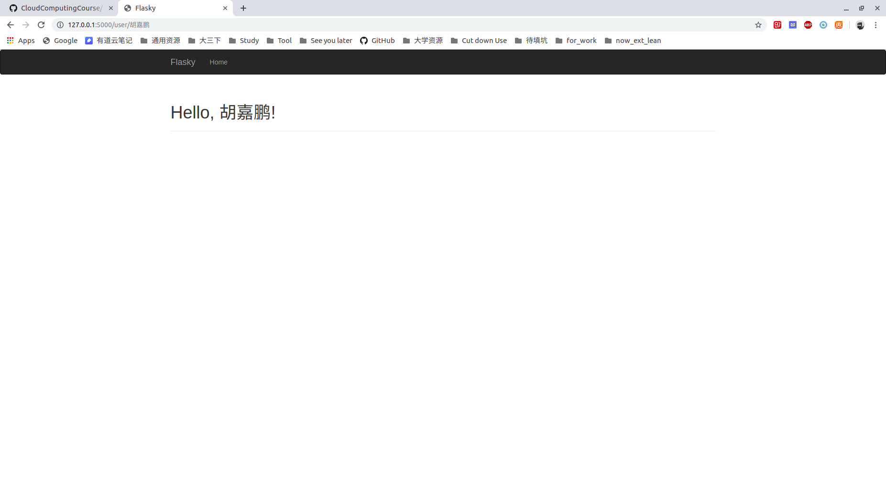

# 第十二、十三周学习周报

## 本周具体工作计划

**Python Flask Web框架学习**

- 研读QQ群文件中的《Flask Web开发：基于Python的Web应用开发》电子书，学习flask框架
- 根据书中的叙述，尝试在自己的开发环境中，开发一个基于Flask的Web应用demo

**研读云晫系统源代码，整理代码结构**

- 项目代码在群文件中的压缩包**web_edu_v1.7.4.0_20171020.tar.gz**解压出来的目录下的 **/build/archives/14.04/project**路径下
- 在报告中列出代码的组织结构（建议使用Pycharm对代码进行研读）
- 根据Flask的框架，思考该项目是怎么启动的，开启一个云桌面调用了哪些接口，哪些包，把启动流程写入报告中。

## 本周主要工作内容

### 已经完成工作

- Python Flask Web框架学习
- 研读云晫系统源代码，整理代码结构

## 未完成工作

无

## 问题与困难

无


# FLASK 学习

`Flask`是一个小型框架，但有十分多的扩展应用，通过这些扩展应用能做到数据库访问，web表单验证，用户身份验证等高级功能。

## 模板

默认使用的是`jinja2`模板引擎

`from flask import Flask, render_template`

## 集成Bootstrap
使用Flask-Bootstrap集成Bootstrap
```python
from flask_bootstrap import Bootstrap

bootstrap = Bootstrap(app)
```

 ## 使用flask-wtf处理表单

```python
from flask_wtf import FlaskForm
from wtforms import StringField, SubmitField
from wtforms.validators import DataRequired
```

## 使用flask-sqlalchemy来管理数据库

```python
import os
from flask_sqlalchemy import SQLAlchemy
basedir = os.path.abspath(os.path.dirname(__file__))
app = Flask(__name__)
```

## 使用flask-mail提供电子邮件支持

```python
app.config['MAIL_SERVER'] = 'smtp.googlemail.com'
app.config['MAIL_PORT'] = 587
app.config['MAIL_USE_TLS'] = True
app.config['MAIL_USERNAME'] = os.environ.get('MAIL_USERNAME')
app.config['MAIL_PASSWORD'] = os.environ.get('MAIL_PASSWORD')
```




