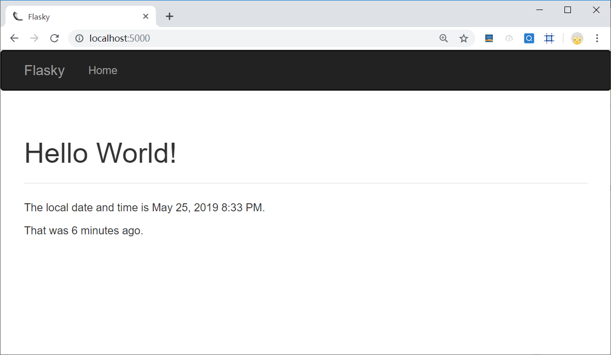
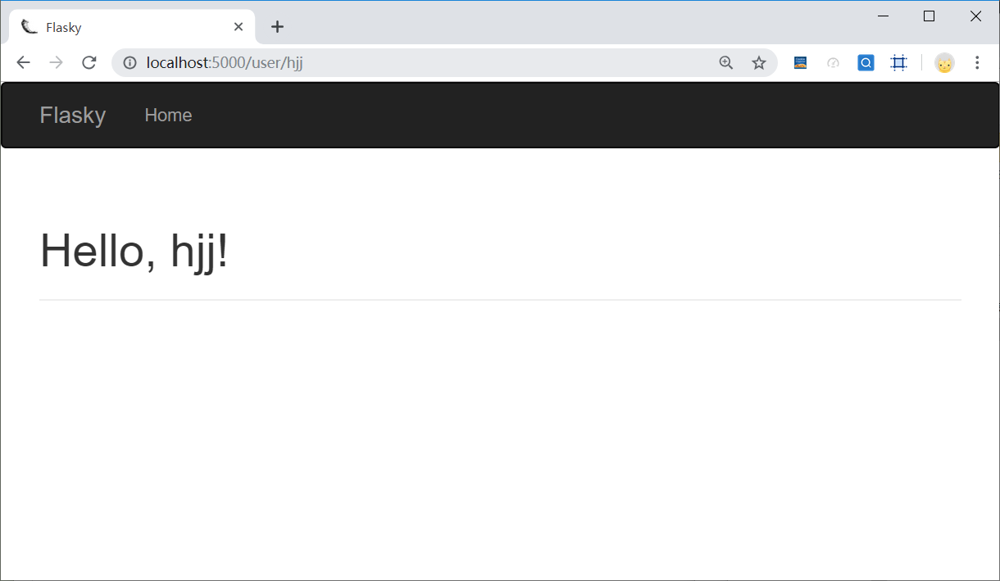
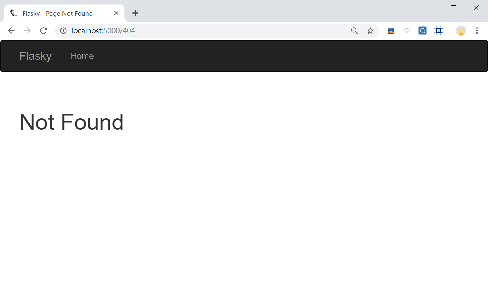

# 第十二、十三周学习周报

## 本周具体工作计划

**Python Flask Web框架学习**

- 研读QQ群文件中的《Flask Web开发：基于Python的Web应用开发》电子书，学习flask框架
- 根据书中的叙述，尝试在自己的开发环境中，开发一个基于Flask的Web应用demo

**研读云晫系统源代码，整理代码结构**

- 项目代码在群文件中的压缩包**web_edu_v1.7.4.0_20171020.tar.gz**解压出来的目录下的 **/build/archives/14.04/project**路径下
- 在报告中列出代码的组织结构（建议使用Pycharm对代码进行研读）
- 根据Flask的框架，思考该项目是怎么启动的，开启一个云桌面调用了哪些接口，哪些包，把启动流程写入报告中。

## 本周主要工作内容

### 已经完成工作

- Python Flask Web框架学习
- 研读云晫系统源代码，整理代码结构

## 未完成工作

无

## 问题与困难

无

## 下周工作计划

---

## Python Flask Web框架学习

### flask框架学习

#### flask简介：

Flask是一个使用 Python 编写的轻量级 Web 应用框架，小到可以称为“微框架”。但是，小并不意味着它比其他框架的功能少。Flask 自开发伊始就被设计为可扩展 的框架，它具有一个包含基本服务的强健核心，其他功能则可通过扩展实现。你可以自己挑选所需的扩展包，组成一个没有附加功能的精益组合，完全满足自身需求。

Flask 有 3 个主要依赖：路由、调试和 Web 服务器网关接口（WSGI，Web server gateway interface）子系统由 Werkzeug 提供；模板系统由Jinja2 提供；命令行集成由 Click 提供。

Flask 原生不支持数据库访问、Web 表单验证和用户身份验证等高级功能。这些功能以及其他大多数 Web 应用需要的核心服务都以扩展的形式实现，然后再与核心包集成。开发者可以任意挑选符合项目需求的扩展，甚至可以自行开发。

#### flask应用demo（windows）

1. flask 安装和使用：

   1. 创建激活虚拟环境：

   ```
   pip install virtualenv
   virtualenv venv
   .\venv\Scripts\activate.bat
   ```

   2. 安装需要使用的Python包：

    ```
   pip install flask
   pip install flask-bootstrap
   pip install flask-moment
   pip install flask_wtf
    ```

   3.  设置启动文件、开启调试模式、启动web应用：

   ```
   set FLASK_APP=hello.py
   set FLASK_DEBUG=1
   flask run
   ```

2. 编写demo代码：

   1. ``hello.py``作为web应用入口程序，使用``@app.route``装饰器对不同路径的请求进行不同的处理。
   2. ``base.html``编写Jinja2模板代码，且作为模板继承的基类。``base.html``中的模板又继承自``bootstrap/base.html``，使页面具有一定的样式。
   3. ``index.html``、``user.html``、``404.html``分别对应不同url请求所响应的页面。``index.html``路径为根路径，``user.html``路径为``/user/<username>``，使用了参数，``404.html``为错误路径所对应的页面。
   4. 添加``static``文件夹作为静态资源文件夹，在其中放入``favicon.ico``图片，客户端可以通过静态资源路径访问得到。

3.  demo结果：
    - 主页面：
    
    
    - 用户页面：
    

    - 未找到：
    

