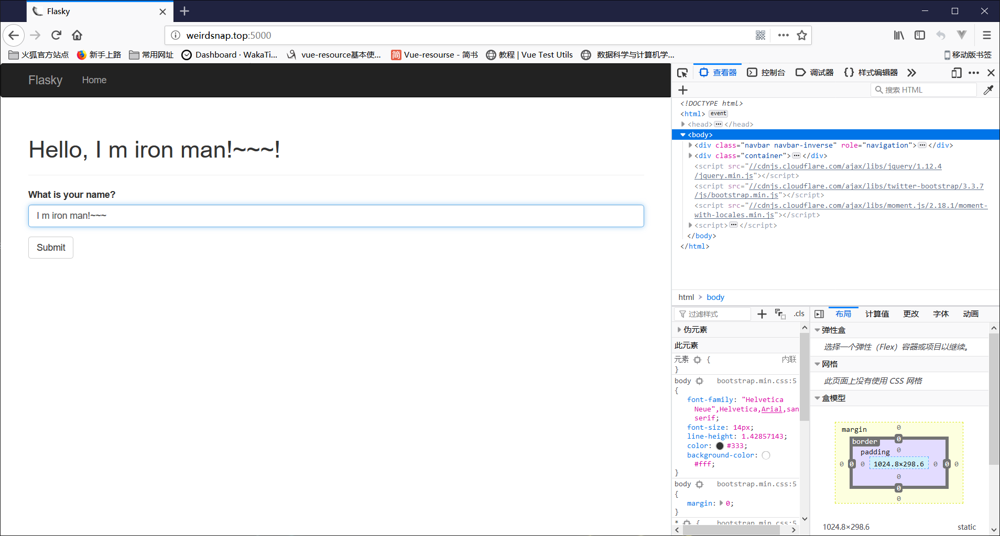

# 12-13周学习报告

## 本周具体工作计划

### Python Flask Web框架学习

研读QQ群文件中的《Flask Web开发：基于Python的Web应用开发》电子书，学习flask框架
根据书中的叙述，尝试在自己的开发环境中，开发一个基于Flask的Web应用demo

### 研读云晫系统源代码，整理代码结构

项目代码在群文件中的压缩包web_edu_v1.7.4.0_20171020.tar.gz解压出来的目录下的 /build/archives/14.04/project路径下
在报告中列出代码的组织结构（建议使用Pycharm对代码进行研读）
根据Flask的框架，思考该项目是怎么启动的，开启一个云桌面调用了哪些接口，哪些包，把启动流程写入报告中。

## 本周主要工作内容
## 已经完成工作

Python Flask Web框架学习

## 未完成工作

研读云晫系统源代码，整理代码结构

## 问题与困难

不太习惯这种后端模板渲染式的web框架。

## 下周工作计划

---

## flask学习报告

flask是一个轻量级的python语言web框架。其特点式简单微小而又具有扩展性。它默认没有包含数据库抽象层表单验证等等功能，但是它提供了很多扩展，你可以自己添加这些。

它使用模板渲染的方式，把模板文件都放在目录下的templates文件夹。并且默认静态文件的存贮在目录下static文件夹下。

它提供了很容易使用的后端路由和表单处理等等功能，也可以通过加载一些UI库使得界面更加美观。

其实现在服务器主要就是通过提供两大服务，一是API资源访问，二是静态文件资源。然后同时内部处理好数据库相关的操作即可。所以在这样的目的下，虽然flask不是特别适合但是它也足够小并且容易扩展。

