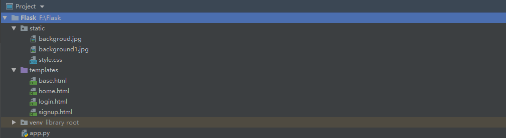
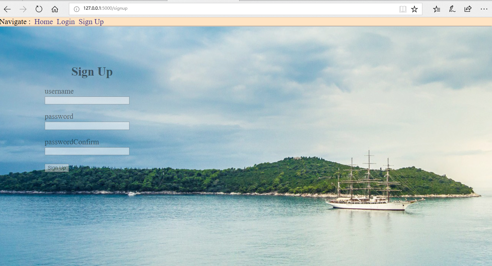
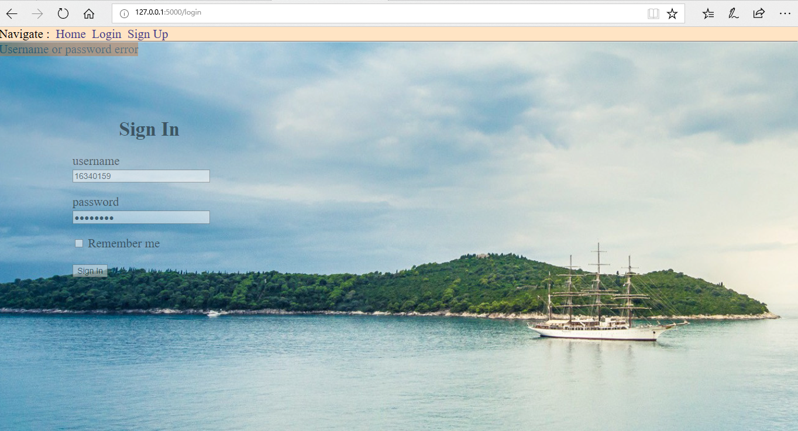
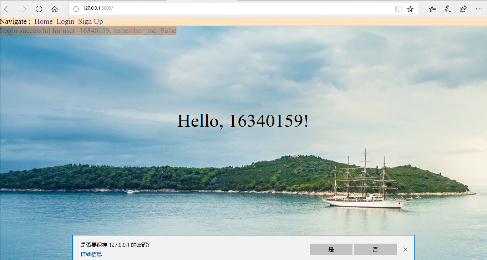

# 本周具体工作计划
- 研读《Flask Web开发：基于Python的Web应用开发》电子书，学习flask框架
- 根据书中的叙述，尝试在自己的开发环境中，开发一个基于Flask的Web应用demo
## 本周工作主要内容  
1. 研读《Flask Web开发：基于Python的Web应用开发》电子书，学习flask框架
2. 根据书中的叙述，尝试在自己的开发环境中，开发一个基于Flask的Web应用demo
### i.已完成工作  
#### Flask简介
Flask 是一个小型框架，但是小并不意味着它比其他框架的功能少。 Flask 被设计为一个可扩展的框架，它具有一个包含基本服务的强健核心，其他功能则通过扩展实现。我们可以自己挑选所需的扩展包，组成一个没有附加功能的精益组合，完全满足自身需求。  
Flask 有 3 个主要依赖：路由、调试和 Web 服务器网关接口（ **WSGI， Web server gateway interface** ）子系统由 **Werkzeug** 提供；模板系统由 **Jinja2** 提供；命令行集成由 **Click** 提供。

#### 基于Flask的Web应用demo（windows环境下）
demo目录结构如下 **（详见Flask文件夹）**:    
	
在这个demo中实现了 **用户注册与登陆** 的功能。 **static** 文件夹下是一些静态文件包括 **css和图片文件等** ； **templates** 文件夹中是一些 **html的模板文件**； **app.py** 是程序的入口，即用命令 ` set FLASK_APP=app.py`设置好环境变量后，用命令 `flask run`就可以在浏览器中通过 ` http://127.0.0.1:5000/ ` 进行访问。 **venv** 是表示python的虚拟环境。  
点击上方导航栏可进行页面跳转  
**注册界面** 
	  
注册成功会跳转到 **登录界面**   
	
登录成功会跳转到 **主界面** ,并显示 **Hello，当前用户名！**
	

### ii. 未完成工作 
无

### iii. 问题与困难
无

## 下周工作计划
暂无