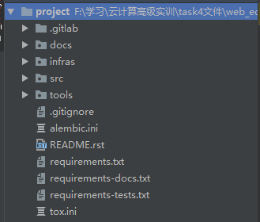
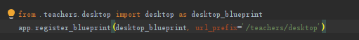

## 一、代码的组织结构
#### 项目总体组织结构：    

#### 各个文件夹中的内容
- **docs** 文件夹中是一些开发的相关文档包括 **开发文档、辅助文档、用户手册** 等
	- 
- **infras** 文件夹中的文档是一些设施的配置信息
	- 
- **src** 文件夹中就是主要的代码文件，其中 **phoenix文件夹** 内的是主要的源代码, **tests文件夹** 中是用于单元测试的代码
	- 
- **tools** 文件夹中是一些 **测试脚本和辅助工具** 
	- 
##### src文件夹中的各个文件夹
- **etc** 文件夹中的文件主要是一些配置信息
- **gateway** 文件夹中主要是一些和网关操作相关的代码
- **licence** 文件夹
	- **app** 文件夹中代码的结构形式是符合 **Flask** 框架的
		- **account** 文件夹中主要是一些用于账户进行操作的代码，包括信息验证、登录等
		- **instance** 文件夹中主要是一些对实例的操作包括创建、更新、删除实例等
		- **key** 文件夹中是一写用于记录密钥的文件
		- **main** 文件夹是web操作的主界面代码
		- **static** 文件夹中是一些静态的文件包括css文件、js文件、图片文件等
		- **template** 文件夹中主要是一些模板文件，包括account界面、instance界面等的html模板文件
	- **migrations** 文件夹里适用于迁移的代码
	- **tools** 文件夹里面的代码适用于辅助对数据库进行操作的
- **phoenix** 文件夹
	- **cloud** 文件夹中的代码主要是调用openstack的API对云中的资源进行操作
	- **common** 文件夹中是一些常用的操作，例如ping命令、锁操作等
	- **db** 文件夹中主要是一些对浮动IP进行操作的代码
	- **security** 文件夹中是一些用于权限认证的代码
- **schedu** 文件夹是分别针对linux和windows操作系统的调度代码
- **test** 文件夹是针对各个模块写的一些测试模块的代码
- **web** 文件夹中就是实现我们能够在浏览器中进行操作的主要代码，其基于 **Flask框架** 来实现
- **websocket** 文件夹中代码与网络服务有关

## 二、一个云桌面的启动流程
**此处以启动一个老师的桌面为例子即teacher-desktop**  
1. 首先通过 **src/web/app/_init_.py** 创建web应用的主体app，其中给app定义了很多个 **蓝图（blueprint）** ，之后再将蓝图交给相应的模块去执行，其中老师的桌面如下：
	  
2. 先要通过路由定位到相关的视图函数的代码，再这个例子中是下面这个函数
	  
3. 在上面那个函数中通过调用相同目录 **utils.py** 中的函数来启动虚拟机
	  
4. 在上面那个函数中先是使用了一个 **db** 对象用于操作数据库，然后使用函数 `DesktopTask()`创建task，之后对task进行相关值的设置，之后调用 **app/celery_tasks.py** 中的如下函数，进行任务的执行  
	  
5. 在上面那个函数中会将启动桌面的任务交付给相同文件中的 **resume_desktop()** 函数来执行
	  
6. 上面那个函数中同样有一个 **db** 对象用于数据库操作，进行一些数据库操作之后，用 **phoenix/cloud/compute.py** 中的  **resume_server(server)** 函数  
	  
7. 从上图中可以看到其调用 IMPL中的函数来完成操作，其中 **IMPL** 来源如下    
	   
8. IMPL 是相同目录下 **utils.py** 文件中定义的，具体详见相关文件
