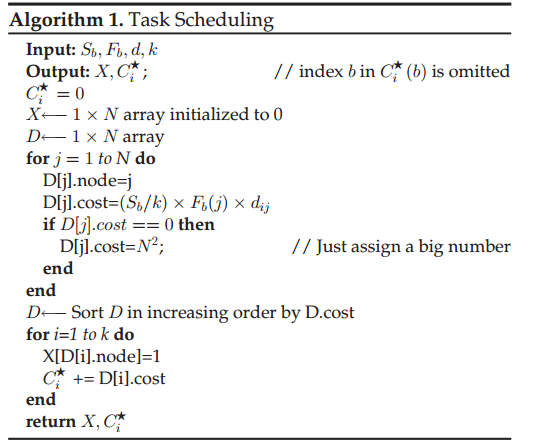
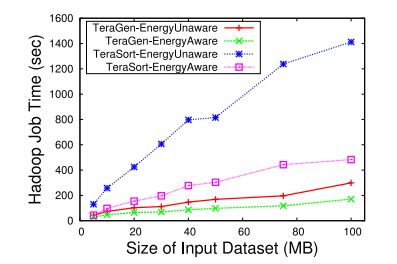

# 题目
<H1> Hadoop MapReduce for Mobile Clouds

## 内容概要
本篇论文所主要描述的工作是在 **Hadoop MapReduce** 云计算框架基础上，考虑到原先的文件系统**HDFS（Hadoop Distributed File System）**是针对静态的网络拓扑结构设计的不能很好的应用于不断变化的移动环境，重新设计了一个新的文件系统 **MDFS（Mobile Distributed File System）**，从而能够更好的将Hadoop MapReduce框架应用到移动环境中。本文主描述了MDFS的主要功能以及如何去实现它，并且还对使用MDFS为文件系统的 Hadoop MapReduce 进行了性能测试。

## 研究背景
随着当代技术的进步，移动设备正逐渐取代传统的个人计算机。新一代移动设备功能强大，具有千兆字节的内存和多核处理器。这些移动设备具有高端计算硬件和复杂的软件应用程序，可生成大约数百兆字节的数据。此数据的范围可以从应用程序原始数据到图像，音频，视频或文本文件。随着移动设备数量的快速增长，移动设备上的大数据处理已经成为提供类似于传统服务器提供的功能的关键新兴必需品。

然而由于移动无线网络环境与传统大数据处理的环境存在很大的差异，现今还无法很高效的使用移动环境来进行大数据处理。现今使用移动网络来处理数据主要存在以下几个问题：  
	1. 移动设备在内存、处理能力和能量方面受到资源约束。由于移动设备是电池供电的，而处理大量数据会耗费大量的能量，因此在进行数据处理任务分配时应该要考虑到这些在传统网络环境主并不存在的问题。  
	2. 移动网络环境是不断变化的，因此数据的可靠性就成为了一个主要的挑战。连接失败可能导致移动设备在有限的参与后脱离网络。
	3. 移动设备中数据的安全性同样是一个待解决的问题。

为了解决上述的问题，本文的作者做了本文中所描述的工作。

## 正文

### 1. MDFS设计
为了解决前面提出的问题，本文的作者重新设计了一种文件系统用于替代Hadoop MapReduce 中的HDFS，从而使得 MapReduce 框架能够更好的应用于移动环境下，具体的设计如下。

####  1.1 MDFS组件
1. MDFS客户端。用户应用程序使用MDFS客户机调用文件系统操作，MDFS客户机是实现MDFS文件系统接口的内置库。
2. 数据处理层。 这一层主要有两个模块组成，分别是 **Name Server** 和 **Data Server**。 其中 Name Server 存储了文件到块的映射信息。 Data Server处理MDFS的通信任务，如相邻节点发现、文件创建、文件检索和文件删除。
3. 网络交流层。 这一层处理网络中节点之间的通信。它在各种文件操作起着交换控制和数据包的作用。这一层中有着三个组成部分分别是 **片段映射器、通信服务器和网络拓扑发现和维护框架**。其中片段映射器用于存储数据块到数据片的映射；通信服务器与每个其他节点交互，并高效节能的传输数据包；网络拓扑发现和维护框架主要用于实时的更新不断变化的移动网络环境。

#### 1.2 系统操作
此论文中对MDFS原有的文件操作进行了扩展，一共实现了以下六种操作：
1. 文件读取操作
2. 文件创建操作
3. 文件写入操作（只支持从文件末尾写入）
4. 文件删除
5. 文件重命名
6. 目录的创建、删除、重命名

#### 1.3 能量感知任务调度
考虑到移动互联网环境中的设备的能耗问题，此论文提出了一个能量感知的任务调度。其伪代码如下：  
  
其中输入的Sb是所要拿到的数据块的大小，k是这个数据块需要的到几个数据片才能复原，Fb是一个数组其中Fb(j)表示第j个节点是否含有所需数据块的数据片，d表示的是节点之间的距离例如dij 表示的是节点i和j之间的距离（跳数）。  
输出的X是用于存储需要从那些节点获取数据所需的传输消耗才是最小的，Ci表示在节点i获取一个所需数据块的最小消耗。根据上述算法计算出所有节点获取数据块的消耗，之后将任务分配给消耗最小的节点来执行。

#### 1.4 错误恢复
1. k-out-of-n框架。此方案将一个文件分割成n个数据片，然而只需要获取k个数据片就能恢复出原来的数据。因此只要故障的节点是小于 n - k， 那么就能够复原出原来的数据片。但是如果 k/n 过小，那么数据冗余就会过多，因此在设置相关参数的时候需要权衡一下。

2. 快照操作创建当前状态的备份映像，其包括内存中的数据结构。 在名称服务器和片段映射器的安全关闭期间，将自动调用快照操作以将状态保存在磁盘上。 重新启动时，保存的映像用于重建系统状态。 当用户正在尝试将来需要轻松回滚的更改时，快照操作特别有用。 当客户端请求快照操作时，名称服务器进入称为安全模式的特殊维护状态。 名称服务器处于安全模式时，不允许客户端操作。 创建备份后，名称服务器将自动退出安全模式。 数据服务器不进行备份，因为它主要处理MDFS通信任务，如邻居发现，文件创建，文件检索。 这些信息随时间变化，因此不必包含在快照中。

### 2. 性能测评
在这篇论文中作者从以下几个方面测试了改项目的性能。  
1. 数据块设置的大小  
2. 集群的大小  
3. 节点故障  
4. 节点故障率  
5. 输入的数据集的大小  
上面的测试中，此论文中的方案均有比较好的表现。 

另外还对比了能量感知的任务调度算法和随机任务调度算法。其中能量感知任务调度算法的效率明显更高如下图：  
  

最后还对比了，此项目在分布式和集中式架构中的优缺点。在分布式架构中由于需要进行大量的广播来保证数据的一致性，因此当分布式集群比较大时，广播会占用大量的带宽。进行对比得到最终结果：分布式架构非常适用于具有独立设备且无中央服务器的中型集群。如果群集不大，则由广播引起的开销很小。对于大型集群，保持元数据在所有节点之间同步所需的通信成本变得非常重要。因此，在大型集群中首选集中式方法。

## 总结与评价
MDFS上的Hadoop MapReduce框架展示了移动设备利用移动环境中大数据稳定增长的能力。 此系统解决了移动云中数据处理的所有限制——能源效率，数据可靠性和安全性。 评估结果表明，此系统能够对非结构化数据（如媒体文件，文本和传感器数据）进行大数据分析。 

