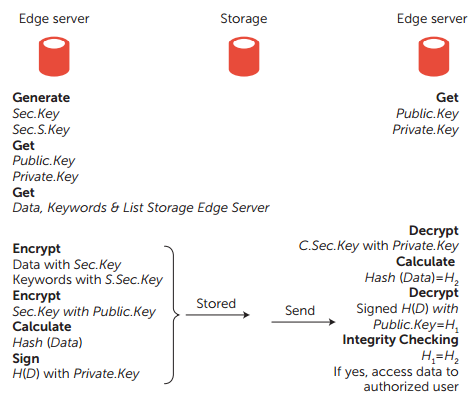
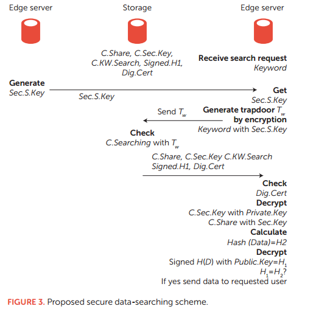
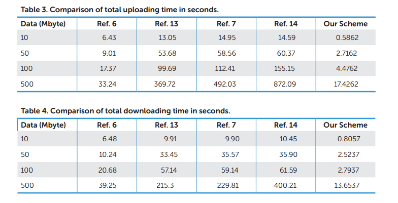

# 题目
<H1> Secure Data Sharing and Searching at the Edge of Cloud-Assisted Internet of Things

## 内容概要
这篇论文主要是提出了一种轻量级加密方案，以便物联网智能设备可以在云辅助物联网的边缘与其他人共享数据。并且对这种加密方案进行性能测试。同时还提出了还提出了一种数据搜索方案，用于由授权用户在存储的数据中搜索所需数据，其中所有数据都是加密形式。

## 研究背景

物联网被认为是未来的互联网，它将互联网的连接扩展到各种现实世界的物理智能设备。思科的一份报告估计，到2020年，将有大约500亿台此类智能设备连接到互联网。通过将数十亿智能设备连接到互联网，物联网将在智能电网，智能城市，智能家居，智能医疗和医疗保健系统，可穿戴技术，交通系统等领域提供开发的智能和自主网络物理环境。然而，这些设备中的大多数是大平台的一部分，因此，在使用过程中会生成大量数据，这需要高安全性和高效率的存储。通常，智能设备具有有限的资源。另一方面，云资源几乎具有无限的存储和处理能力，可扩展性和随时随地访问。因此，在云的帮助下，物联网智能设备可以减轻有限资源的负担。   

随着智能设备数量和可用性的增加，云辅助物联网应用中提供了数据共享。如果智能设备不与其他设备共享数据，则数据几乎没有用。边缘的数据共享允许智能设备以更低的延迟共享数据，并具有快速数据访问和更高带宽。然而当物联网智能设备与其他设备共享数据时，会出现潜在的安全问题，例如数据泄漏，修改，完整性和未经授权的访问。因此，在边缘共享时，必须确保这种共享数据的机密性，完整性和访问控制。此外，需要安全的数据搜索技术来由授权设备搜索和检索共享数据。目前，解决云中安全数据共享和搜索挑战的解决方案很少。

## 正文

### 1. 相关的加密机制
1. 密钥加密技术（对称加密）
2. 公钥加密（非对称加密）
3. 可搜索的密钥加密（trapdoor）
4. 单向散列算法
5. 数字签名

### 2. 此方案系统的四个主要实体

1.智能设备  
2.边缘服务器  
3.证书颁发机构  
4.密钥生成服务器  

### 3. 方案的四个主要组成
为了使方案的设计较为简单，作者做了如下三个假设：
   
- 边缘服务器是半固定的，并且能够实现对共享/搜索数据的安全性  
- 在边缘服务器中存在一个密钥生成器，可以将这些密钥安全地传递给其他边缘服务器  
- 能设备无法生成密钥，加密或解密，并且无法保证自己的数据安全  

#### 3.1 密钥生成 
密钥生成有边缘服务器中的密钥生成器来生成。其主要生成两个256bit 的密钥，分别是用于数据共享的  **Sec.Key** 和 数据搜索的 **S.Sec.Key**

#### 3.2 数据和关键字上传
在只能设备将数据和关键字（还有可访问该数据的用户列表）上传到边缘设备后边缘服务器执行下面的操作：  

1. 用Sec.Key 对数据进行加密，记为 C.Share  
2. 用S.Sec.Key 对关键字进行加密，记为C.KW.Search  
3. 用Public.Key对Sec.Key进行加密，记为C.Sec.Key（Public.Key是授权用户的公钥）  
4. 使用抗冲突哈希函数计算原始数据的hash值记为H1  
5. 使用Private.Key对H1进行加密（Private.Key是数据创建者的私钥）记为Signed.H1  
6. 最终数据存储格式(C.Share || C.Sec.Key ||C.KW.Search || Signed.H1 || Dig.Cert)，其中Dig.Cert时由第三方证书颁发机构颁发的数字证书  

#### 3.3 数据共享和下载
边缘服务器下载了所要的数据元组之后，进行如下操作：

1. 先确认数字证书Dig.Cert是否有效
2. 使用Private.Key 对 C.Sec.Key 得到 Sec.Key（其中Private.Key 是授权访问用户的私钥)
3. 使用得到的 Sec.Key 对 C.Share 进行解密得到 Data
4. 根据得到的Data计算 hash值，记为H2
5. 使用 Public.Key解密 Signed.H1 得到 H1 （其中Public.Key是数据发布者的公钥）
6. 判断 H1与H2是否想等
7. 如果相等则数据是完整的，最终将Data发给数据请求者。

流程图如下：  

#### 3.4 数据搜索和检索
与数据共享和下载相比，此操作多了一个根据请求的关键字列表和S.Sec.Key生成trapdoor,并且将trapdoor发送到存储进行检索的过程  

### 4. 性能测评
将此此篇论文所提出的方案与之前相关的研究方案做对比结果如下：  
  
可以看到在处理时间方面的有显著的提升。

## 总结与评价
在本文中，作者提出了一种数据共享和搜索方案，以便在云辅助物联网的边缘通过物联网智能设备安全地共享和搜索数据。 并且性能分析表明，与现有的基于云的系统相比，本文的方案在处理时间方面可以实现更高的效率。 

