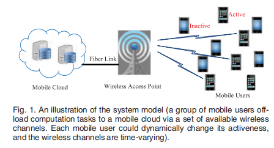

## 标题
- 《Dynamic Computation Offloading for Mobile Cloud Computing: A Stochastic Game-Theoretic Approach》

### 概要
- 随着移动应用程序的日益普及，移动云计算已被设想为一种增强移动设备计算能力和降低能耗的有前途的方法。在本文中，我们研究了动态环境下移动云计算的多用户计算卸载问题，其中移动用户动态变为活动或非活动，移动用户卸载计算的无线信道随机变化。作为移动用户在将计算任务卸载到移动云时是以自我为中心和自私的，我们制定了移动用户的卸载决策在动态环境下作为随机博弈的过程。我们证明了所制定的随机游戏等同于具有至少一个纳什均衡（NE）的加权势游戏。我们量化了NE的效率，并进一步提出了一种多智能体随机学习算法（MASL算法），以保证收敛速率（也是分析导出的）到达NE。最后，我们进行模拟以验证所提算法的有效性，并在动态环境下评估其性能。

### 正文

#### 1.主要贡献
1）建立一个随机博弈模型并分析在动态环境下多用户计算卸载问题，为证明制定随机博弈过程中NE的存在，我们证明这等价于一个加权势博弈至少存在一个NE，分析了性能界限（bound）
关于从云计算中获益用户数量以及系统成本。  
2）提出一种多智能体随机学习算法来达到多用户博弈的纳什平衡（该算法在不进行任何信息交换的情况下以完全分布式的方式运行），例如，每个用户独立调整其计算卸载根据收到的（行动奖励）
action-reward，而不是知道其他用户的卸载策略细节决定。  
3）从理论上推导了多智能体随机学习算法的收敛速度。在动态环境下，证明设计的多用户交互学习算法的收敛性在技术上具有挑战性，本文的研究是第一个成功解决这一问题的研究。  

#### 2.系统模型
  
通信系统以时隙方式（几微秒或毫秒）操作，一个计算卸载时期（几秒）包含多个时隙，一个用户有计算任务执行会变得active，否则inactive，使用二项分布表示用户与AP之间的信道满足瑞利衰落,其中AP包括WiFi接入点，3G/4G macro-cell或者small-cell。  

#### 3.博弈模型
  
- 随机博弈模型分为三种：①活跃用户，静态情况下的博弈模型。②全部用户，静态情况下的博弈模型。③全部用户，动态情况下的随即博弈模型。

由于每个有限博弈的随机博弈模型一般存在一个NE，找出了NE的存在也就找到了整个系统计算卸载到云端的一个最优的情况，接下来文中提出了关于三种博弈模型NE的定义。

#### 4.纳什均衡的分析

#### 5.MASL算法
- 由于动态环境与分布式方法，但是移动用户很难达到NE，大多的博弈论算法，空间自适应博弈更新用户的策略基于他们接收到的瞬时效用或者瞬时payoff，但是用户活跃度和无线信道的动态性，每个用户在不同的时隙会得到不同的效用，即便使用相同的策略。
  
MASL算法的提出为了求出随机模型g2的纳什均衡。  

### 总结
- 在我们未来的工作中，我们将研究动态卸载决策和传输功率控制的联合优化，这将是一个重要且技术上具有挑战性的问题。另一个有趣的方向是从经济学角度研究移动计算卸载，特别是考虑移动用户将计算任务卸载到移动云的经济费用。

