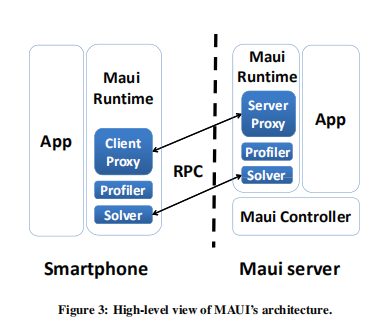
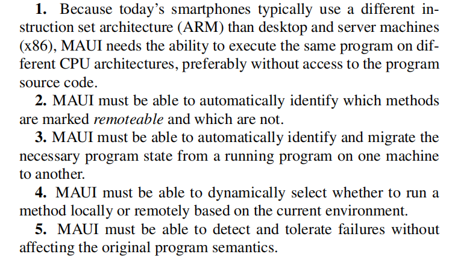
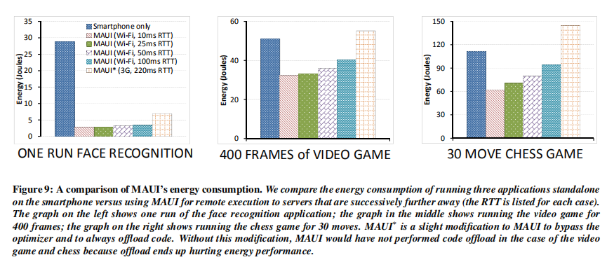
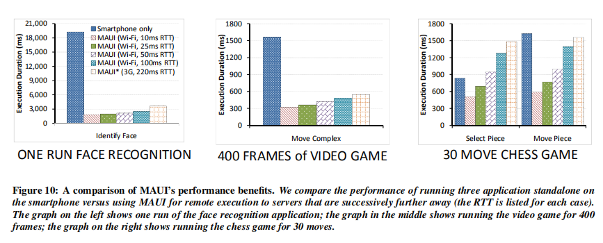
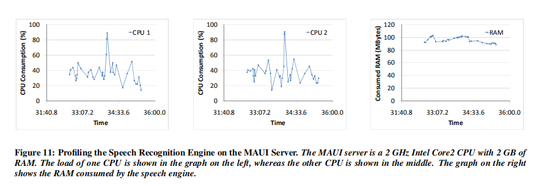
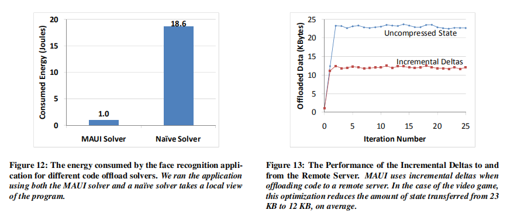

## 标题
《MAUI: Making Smartphones Last Longer with Code Offload》

## 概要
- 本文介绍了MAUI，这是一种能够将细粒度的能量感知卸载移动代码到基础设施的系统。以前解决这些问题的方法或者很大程度上依赖于程序员对分区应用程序的支持，或者它们是粗粒度的，需要完整的进程（或完整的VM）迁移。 MAUI利用托管代码环境的优势提供两全其美的优势：它支持细粒度的代码卸载，以最大限度地节省能源，同时最大限度地降低程序员的负担。 MAUI在运行时决定哪些方法应该远程执行，由优化引擎驱动，在移动设备的当前连接约束下实现最佳节能。在我们的评估中，我们展示了MAUI能够实现：1）资源密集型人脸识别应用程序，消耗的能量减少了一个数量级; 2）延迟敏感的街机游戏应用程序，其刷新率翻倍，以及3）语音基于语言的翻译应用程序，通过远程执行不受支持的组件来绕过智能手机环境的限制。

## 正文
#### 前提
- 未来智能电话发展的最大阻碍是电池技术，处理器更快，屏幕更清晰，更多的传感器，电池提供的能量小于手机消耗的能量。
- 一种减少能量需求的方式：远程执行（remote execution）
- 远程执行的方法一：依赖程序员（决定程序分块，需要远程的状态，如何采用程序分块模式挑战网络情况等）
- 远程执行的方法二：全进程或全VM迁移（减少程序员负担，所有代码和程序状态都会自动发送到远程基础设备）
- MAUI架构：联合以上两种方法，最大化节约能耗的潜能通过细粒度的代码卸载，通过使用公共语言运行库(Common Language Runtime)，它负责资源管理（内存分配和垃圾收集等）实现远程执行。
  
- 在smartphone，MAUI runtime由三个组件组成：1）Solver，决策引擎的接口，实际上MAUI服务器上运行。2）Proxy，代理，处理卸载方法的控制和数据传输。3）Profiler，分析器，负责监控程序并收集程序能量和数据传输要求的测量值。
- 在MAUI server, MAUI提供四个组件：Profiler和Serverside Proxy，与客户端对应方执行类似的角色；决策引擎（decision engine），也就是求解器Solver，定期解决线性程序；MAUI coordinator，协调器，处理传入请求的身份验证和资源分配，以实例化分区的应用程序。

#### .NET程序分块

#### 评估
- 我们使用宏基准测试和微基准测试的组合来评估MAUI改善智能手机应用程序的能耗和性能的能力。  

##### Macrobenchmarks
1）MAUI减少多少移动应用程序的能耗？  
  
2）MAUI提高了移动应用程序多少性能？  
  
3）MAUI可以运行资源密集型应用程序吗？  
  

##### Microbenchmarks
1）MAUI solver的性能开销是多少？  
2）MAUI求解器（solver）是否有效根据程序的全局视图识别卸载机会？  
3）减少MAUI数据传输开销的增量deltas有效吗？  
4）求解器是否适应不断变化的网络条件个别方法的计算成本的变化？  
 

## 总结
- 在本文中，我们提出了一种系统，该系统能够实现细粒度的能量感知卸载移动代码到基础设施。 MAUI利用托管代码的优势来减轻程序员处理程序分区的负担，同时最大限度地提高卸载代码的能量优势。 本文介绍了MAUI如何对程序进行分区，如何对程序进行分析，以及如何将程序分区作为0-1整数线性规划问题进行分解和解决。 在我们介绍MAUI架构的过程中，我们还展示了几个在实现过程中发现的低级挑战的例子。 我们的结果表明，MAUI的节能和性能令人印象深刻（我们的一个应用程序可达一个数量级）。

