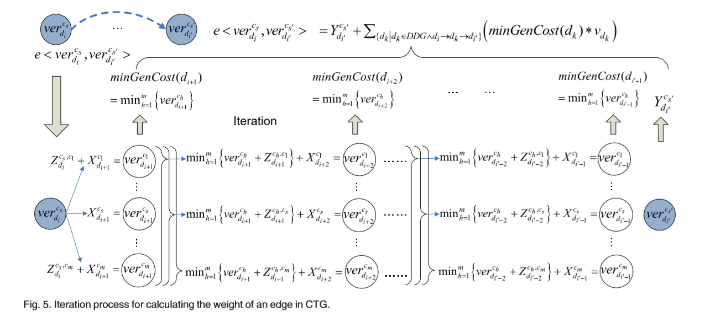

# 论文题目：An Algorithm for Finding the Minimum Cost of Storing and Regenerating Datasets in Multiple Clouds

## 技术问题
云中的计算、存储和带宽之间存在权衡，不同的存储和更新策略导致存储生成的应用程序数据的总成本不同。鉴于此，用户需要全面了解云计算的成本，在使用多路广播服务提供商存储和重新生成数据时，以便利用云计算的成本效益。
## 研究背景

近年来，云计算作为最新的计算范式出现，为用户提供了冗余、廉价、可伸缩的资源需求。IaaS(基础设施即服务)是在云中交付服务的一种非常流行的方式，用户可以将其应用程序部署在统一的云资源中，如计算、存储和网络服务，而无需任何基础设施投资。然而，除了使用随需应变的云服务带来的便利之外，用户还必须根据即付即用的模型为所使用的资源付费，这可能是非常重要的。特别是，现在应用程序的数据密集型越来越大，生成的数据通常是GB、TB甚至PB大小。这些生成的数据包括
计算的重要中间结果或最终结果，这些结果可能需要存储以便重用。因此，在云计算环境中部署应用程序时，以即付即用的方式降低基于云的数据管理的成本成为一个大问题。

## 正文
该论文中介绍了一种GT-CSB算法，以此找到数据集的最小成本存储和更新策略。

#### CT-CSB算法
- 该算法基于DDG构造成本传递图(CTG)。首先，对于DDG[1]中的每个数据集，我们在CTG中创建一组顶点，这些顶点表示来自不同云服务提供者的服务，数据集可以存储或重新生成。然后，我们向CTG添加边，并确保CTG中的路径(从开始顶点到结束顶点)与DDG中的数据集的存储策略有一对一的映射。
- 在CTG中设置边缘的权重。我们给出了如何计算边的权值，以保证CTG中每条路径的长度(从一个开始点到一个结束点)等于相应存储策略的总成本率，同时使用删除数据集的最小成本再生策略。
- 找出CTG中的最短路径。用Dijkstra算法来找到CTG中的最短路径,即云的计算、存储和带宽成本之间的最佳权衡。

#### GT-CSB算法在线性DDG上的实现步骤
- 给定一个线性DDG与数据集{d1, d2，…dn}和m云服务{c1, c2，…cm}用于存储。
1.  基于DDG构造CTG。首先创造一个开始和结束的节点，然后对DDG中的每条边，创建一个节点集合。  
2.  为CTG创建有向边。

3. 在CTG中设置边缘的权重。

4. 找出最短路径。

伪代码：

#### 应用

GT-CSB算法的主要贡献是计算在多个云中存储和重新生成数据集的最低成本。它可以广泛应用于云计算。用户可以

1)设计最小成本基准方法来评估云计算的成本效益; 

2)设计有效的策略来存储和重新生成应用程序数据集，并了解应用程序的成本构成。

##### 1. 最低成本基准方法
给定一个通用的DDG，随机选择一个线性数据依赖路径作为“主分支”来构造CTG, DDG中的其余数据集作为“子分支”。然后，在“主分支”的CTG上调用GT-CSB算法，并根据智能规则递归调用“子分支”算法，将权重设置为不同类型的边。最后找到整个DDG的最小成本存储和再生策略。

##### 2.具有成本效益的储存和再生策略
GT-CSB算法也可用于设计有效的存储和再生策略。与基准测试方法不同，最小成本策略可能不是存储和重新生成数据集的最佳策略。除了成本效益外，一个好的策略应该考虑用户的偏好(例如，用户对数据访问延迟的容忍度)。

为了反映用户的偏好，我们可以通过引入两个参数T和l来增强GT-CSB算法，这两个参数与我们之前的工作相同。T是表示用户对数据访问延迟的容忍度的参数。用户需要通知云服务提供者关于数据集的信息，说明他们对数据集的可用性有要求。l是用于调整存储策略的参数，当用户在最低成本基准之上有额外的预算来存储更多的数据集，以减少平均数据集访问时间。

#### 测评

经过测评，随着DDG中的数据集数量和云服务提供商数量的增长，该算法具有多项式时间复杂度。

## 总结和评论
该论文介绍了一种算法以实现数据集的最小成本存储和更新策略。通过图论和最短路算法的优化显著降低了成本，提高了效率。实验结果也显示了这种算法的优良性。但是也有不足之处，比如云服务的价格在现实中是不相同的，不同云服务提供商之间的“供应商锁定”问题、来自I/O内部应用程序的大量请求等都可能导致额外的成本。而且算法的设计效率还没得到全面的研究，算法复杂度有待降低。

[1]DDG是一种基于数据来源的有向无环图(DAG)。在云中生成的所有数据集，无论是存储的还是删除的，它们的引用都记录在DDG中。换句话说，它描述了数据集的生成关系，通过这些关系，可以从最近的现有数据集中重新生成删除的数据集。

